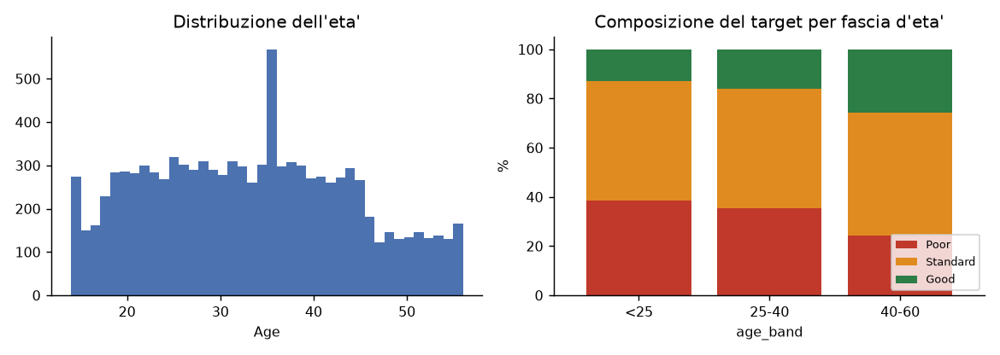
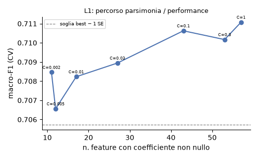
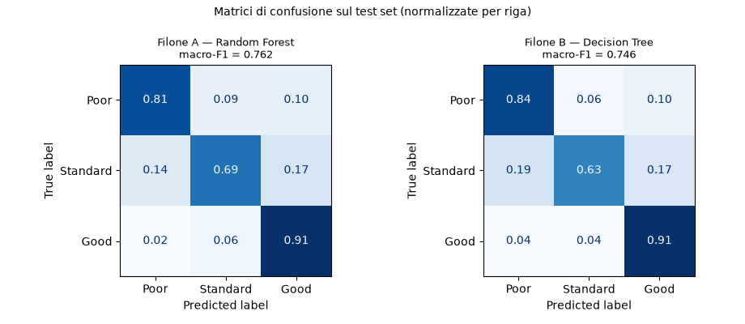
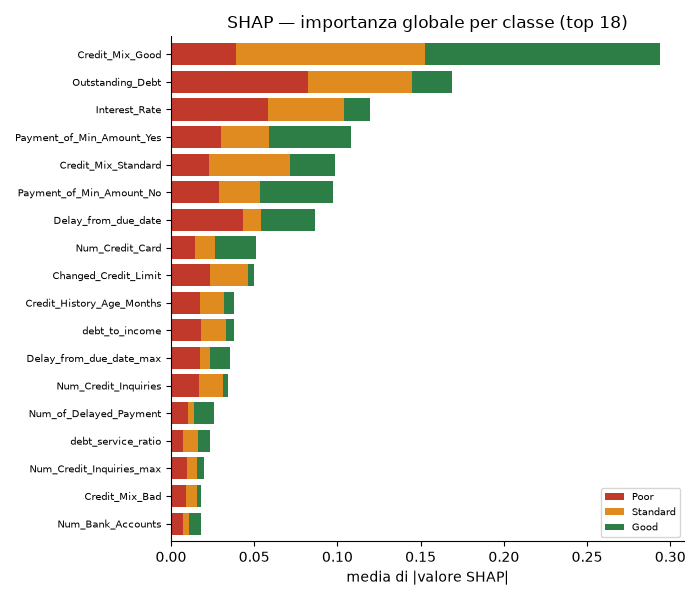
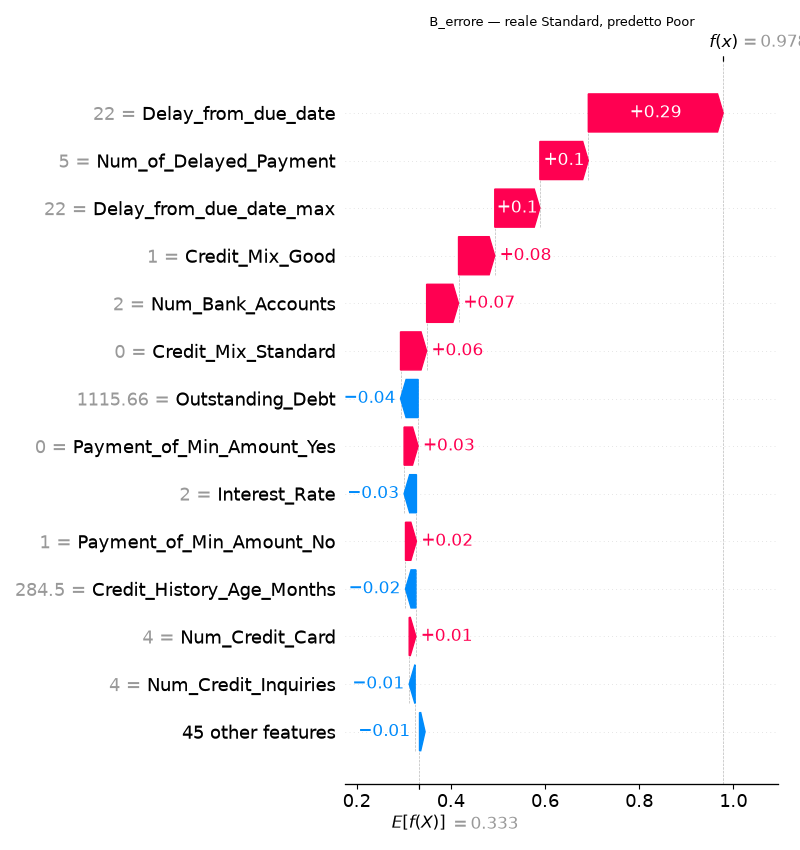
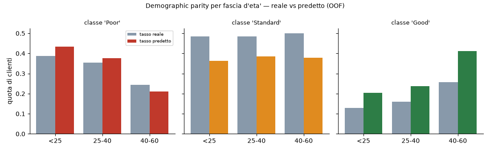
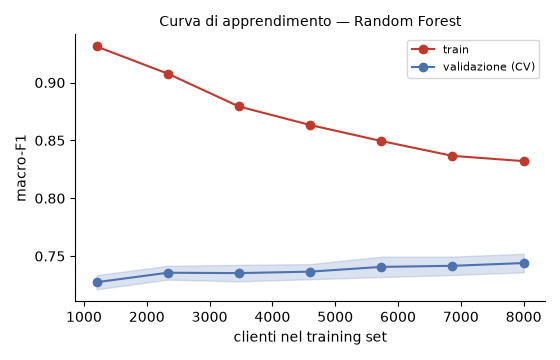

# Figure selezionate per la presentazione

Sottoinsieme di `reports/figures/` (19 figure) che regge un'affermazione della tesi, in ordine di esposizione.

### 01_problema_tre_classi.png

Il problema: tre classi sbilanciate (49/33/18%). Motiva macro-F1 e class weighting.

### 02_feature_informative.png

Quali variabili portano segnale: mix di credito, tasso, debito, ritardi — le famiglie canoniche di uno score reale.

### 03_eta_e_target.png

Distribuzione dell'eta' e composizione del target per fascia: la base del fairness check, e la disparita' gia' presente nei dati.

### 04_parsimonia_L1.png

Percorso di regolarizzazione L1: da 57 a 11 feature si perdono 0,26 punti. L'80% delle variabili non serve.

### 05_albero_finale.png

Il modello del Filone B per intero: profondita' 4, 14 foglie. La prima domanda che pone e' il mix di credito, come farebbe un analista.

### 06_confusione_test.png

Prestazioni sul test set per entrambi i filoni. L'errore si concentra su 'Standard'; confusione Poor<->Good quasi assente (2,2%).

### 07_shap_globale.png

Su cosa si basa il Random Forest, per classe. Le due feature principali sono pero' output del processo di scoring a monte.

### 08_shap_caso_errore.png

Un cliente 'Standard' classificato 'Poor' con p=0,98. La spiegazione e' quasi identica a quella di un vero 'Poor': rumore del label, non del modello.

### 09_fairness_eta.png

Tasso reale vs predetto per fascia d'eta': il modello *amplifica* la disparita' esistente in entrambe le direzioni.

### 10_curva_apprendimento.png

La curva e' piatta: il limite non e' la numerosita' del campione.
