# Classificazione del merito creditizio: quanto costa la trasparenza?

**Un caso di studio su interpretabilità, rumore del label e fairness in un problema di credit scoring multi-classe**

Progetto d'esame di Machine Learning — Università di Genova
Dataset: `parisrohan/credit-score-classification` (Kaggle)
Codice: `src/` — riproducibile con `python src/run_all.py`

---

## Abstract

Affrontiamo la classificazione multi-classe del merito creditizio (`Poor` /
`Standard` / `Good`) su 12.500 clienti, ciascuno osservato per 8 mesi. Il lavoro
è strutturato attorno a una domanda che nel credito è normativa prima che
tecnica: **quanto si perde, in performance, a usare un modello che un cliente
può capire?**

Costruiamo due modelli finali con protocolli identici — un *Filone A* che cerca
il modello più semplice sufficiente, e un *Filone B* vincolato alla piena
interpretabilità — e ne quantifichiamo la distanza. Il risultato centrale è che
passare da un Random Forest di 300 alberi (≈118.000 foglie) a **un singolo
albero di profondità 4 con 14 foglie** costa **1,58 punti di macro-F1**
(0,7617 → 0,7459).

Tre risultati secondari sono metodologicamente più interessanti del primo:

1. **L'aggregazione per cliente non è un costo, è un guadagno.** Elimina il data
   leakage fra mesi dello stesso cliente e, contemporaneamente, filtra il rumore
   iniettato nei dati: +8,6 punti di accuratezza rispetto all'equivalente
   rigoroso a livello riga.
2. **Il label è rumoroso e pone un tetto**: il giudizio originale, sullo stesso
   cliente e con feature quasi identiche fra un mese e l'altro, cambia nel 15,6%
   dei mesi. Il tetto però **non era ancora stato raggiunto**: su un dataset 3×
   più grande il Random Forest guadagna +1,88 punti, mentre l'albero di
   profondità 4 resta fermo — la sua capacità satura a 14 foglie (§8.3-bis).
3. **Il modello amplifica la disparità d'età presente nei dati**, e rimuovere
   l'età dalle feature non serve a niente: la disparità passa dai proxy.

---

## Come leggere questo documento

Il documento è autosufficiente. Per rendere accessibile la trattazione anche a
lettori non specialisti, ogni costrutto tecnico è preceduto da un riquadro di
sintesi divulgativa:

> **In parole semplici.** Formulazione dell'idea priva di formalismo, destinata
> a chi non abbia familiarità con l'apparato tecnico.

Alla sintesi segue la trattazione formale. Il lettore esperto può ignorare i
riquadri senza perdita di contenuto; il lettore non specialista può limitarsi ad
essi per una comprensione d'insieme.

**Indice**

1. [Il problema e il dominio](#1-il-problema-e-il-dominio)
2. [Dati](#2-dati)
3. [Metodo](#3-metodo)
4. [Risultati](#4-risultati)
5. [Valutazione finale sul test set](#5-valutazione-finale-sul-test-set)
6. [Interpretabilità](#6-interpretabilità-q5)
7. [Fairness](#7-fairness)
8. [Analisi diagnostica dei limiti di performance](#8-analisi-diagnostica-dei-limiti-di-performance-q7)
9. [Discussione, model card, limiti](#9-discussione-model-card-limiti)
10. [Appendici](#10-appendici)

---

# 1. Il problema e il dominio

## 1.1 Il compito

Dato lo storico creditizio di un cliente, assegnargli una fra tre classi di
merito: `Poor`, `Standard`, `Good`. È un problema di **classificazione
multi-classe supervisionata** su dati tabellari.

## 1.2 Struttura informativa di un credit score

Un credit score sintetizza il rischio che un soggetto non onori un'obbligazione
creditizia. Nel mondo reale è prodotto da bureau (FICO, VantageScore, CRIF) a
partire da cinque famiglie informative con pesi noti e stabili. Il dataset le
copre **tutte e cinque**:

| Famiglia informativa | Peso tipico FICO | Colonne corrispondenti |
|---|---|---|
| Storia dei pagamenti | ~35% | `Delay_from_due_date`, `Num_of_Delayed_Payment`, `Payment_of_Min_Amount` |
| Ammontare del debito / utilizzo | ~30% | `Outstanding_Debt`, `Credit_Utilization_Ratio` |
| Lunghezza della storia creditizia | ~15% | `Credit_History_Age` |
| Mix di credito | ~10% | `Credit_Mix`, `Type_of_Loan` |
| Nuove richieste di credito | ~10% | `Num_Credit_Inquiries` |

Questo è rilevante metodologicamente: **non è un dataset tabellare qualunque su
cui provare algoritmi**, è credit scoring genuino. Ci autorizza a leggere i
risultati col lessico del dominio (delinquenza, utilizzo, debt-to-income) invece
che solo con quello statistico, e ci dà un'aspettativa *a priori* su quali
variabili dovrebbero contare — aspettativa che potremo usare come controllo di
sanità sui risultati.

## 1.3 Vincoli normativi sull'interpretabilità

> **In parole semplici.** In molti problemi di machine learning, se il modello
> indovina bene non importa come ci arriva. Nel credito no: se a una persona
> viene negato un prestito, ha il **diritto legale** di sapere perché. Un
> modello che non sa spiegarsi non è solo poco elegante — è inutilizzabile.

Il credit scoring è fra le applicazioni più regolate del machine learning:

- **EU AI Act** — la valutazione del merito creditizio delle persone fisiche è
  esplicitamente classificata **ad alto rischio** (Allegato III, punto 5b), con
  obblighi di gestione del rischio, data governance, documentazione tecnica,
  trasparenza e sorveglianza umana.
- **GDPR art. 22 + considerando 71** — diritto a non essere sottoposti a
  decisioni interamente automatizzate con effetti giuridici significativi, e
  diritto a ottenere una spiegazione della logica applicata.
- **ECOA / Regulation B (USA)** — obbligo di *adverse action notice*: al cliente
  rifiutato vanno comunicate le ragioni specifiche e principali. La CFPB ha
  chiarito (circolare 2022-03) che usare modelli complessi non esime
  dall'obbligo.
- **Accordi di Basilea / EBA** — sui modelli interni si richiede che i driver di
  rischio siano economicamente spiegabili, non solo statisticamente performanti.
  (Nota: "Basilea" indica il Comitato di Basilea presso la BRI, standard
  internazionali recepiti in UE via CRR/CRD — non normativa svizzera.)

Due conseguenze dirette sull'impianto del progetto:

1. La struttura a due filoni non è un esercizio accademico: è la scelta che
   un'istituzione deve realmente motivare, e **il prezzo in performance della
   trasparenza va quantificato**, non assunto.
2. Le spiegazioni locali (§6) sono la forma tecnica di un obbligo giuridico —
   l'*adverse action notice* — non un abbellimento.

## 1.4 Natura del target: un giudizio, non un evento osservato

Il target `Credit_Score` **non è un default osservato**: è una classificazione
già prodotta da un processo di scoring a monte. Il modello impara quindi a
**replicare un giudizio esistente**, non a predire un'insolvenza futura.

Due implicazioni serie, che tornano in tutto il resto del documento:

- Feature come `Credit_Mix` e `Interest_Rate` sono a loro volta **output** di
  quel processo (il tasso applicato dipende dal merito già valutato). Il loro
  peso elevato va letto come coerenza interna col sistema di scoring esistente,
  non come scoperta causale sul rischio.
- Qualunque bias del processo originale viene appreso e riprodotto. È
  esattamente la ragione per cui il check di fairness (§7) è dovuto, e per cui
  va interpretato come misura di *conservazione del bias*, non di *equità*.

## 1.5 Domande di ricerca

| # | Domanda | Sezione |
|---|---|---|
| Q1 | Il problema richiede un modello non lineare? | §4.1 |
| Q2 | Qual è il modello più semplice che raggiunge la performance necessaria? | §4.2 |
| Q3 | Quanto lontano si arriva restando pienamente interpretabili? | §4.3 |
| Q4 | Quanto costa la trasparenza, in punti di metrica? | §5 |
| Q5 | Su cosa si basa il modello, globalmente e sul singolo cliente? | §6 |
| Q6 | Il modello tratta allo stesso modo le fasce d'età? | §7 |
| Q7 | Perché l'accuratezza si ferma al 76,9% e non al 90%? | §8 |

---

# 2. Dati

## 2.1 Struttura

| | |
|---|---|
| Righe | 100.000 |
| Colonne | 28 |
| Clienti unici (`Customer_ID`) | 12.500 |
| Righe per cliente | esattamente 8 (gennaio–agosto), per tutti |
| Target | `Credit_Score` ∈ {Poor, Standard, Good} |

Il panel è perfettamente bilanciato: nessun cliente ha mesi mancanti.

**Distribuzione del target** (a livello cliente, dopo l'aggregazione di §2.5):

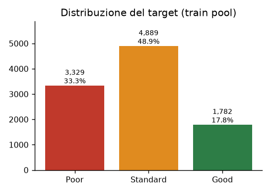

*Figura 1 — Distribuzione delle tre classi sul train pool. Rapporto di
sbilanciamento max/min = 2,74.*

`Standard` copre il 48,9% dei clienti, `Poor` il 33,3%, `Good` il 17,8%. Lo
sbilanciamento è moderato — non estremo — ma sufficiente a rendere l'accuratezza
una metrica fuorviante (§3.1).

## 2.2 Rumore di tipo I: valori sentinella

> **In parole semplici.** Chi ha costruito questo dataset non ha scritto "dato
> mancante" nelle caselle vuote: ci ha scritto dentro dei simboli strani, come
> `_______` o `!@9#%8`. Se non ce ne accorgiamo, il modello li tratta come se
> fossero categorie vere — come se "`!@9#%8`" fosse un modo di pagare.

Il dataset codifica i missing come stringhe, non come `NaN`. Verificato
sull'intero CSV:

| Colonna | Sentinella | Righe | % |
|---|---|---:|---:|
| `Credit_Mix` | `_` | 20.195 | 20,2% |
| `Payment_of_Min_Amount` | `NM` | 12.007 | 12,0% |
| `Payment_Behaviour` | `!@9#%8` | 7.600 | 7,6% |
| `Occupation` | `_______` | 7.062 | 7,1% |
| `SSN` | `#F%$D@*&8` | 5.572 | 5,6% |
| `Amount_invested_monthly` | `__10000__` | 4.305 | 4,3% |
| `Changed_Credit_Limit` | `_` | 2.091 | 2,1% |
| `Monthly_Balance` | `__-3333…33__` | 9 | <0,1% |

**Avvertenza.** `__10000__` è la sentinella più insidiosa: ripulita dai caratteri
spuri diventa `10000.0`, un valore numerico perfettamente plausibile. Se la si
convertisse prima di rimuoverla, il 99° percentile di `Amount_invested_monthly`
diventerebbe esattamente 10.000 — un artefatto puro che nessuna ispezione
successiva rivelerebbe come tale.

**Conseguenza implementativa:** nella pipeline le sentinelle sono rimosse
**prima** della conversione numerica (`data_prep.clean_rows`, passo *a*), non
dopo. L'ordine delle operazioni qui è sostanziale, non stilistico.

Altre colonne numeriche sono sporcate da un `_` finale (`Age` → `28_`,
`Annual_Income` → `14388.79_`): fra 1.000 e 7.000 righe ciascuna.

## 2.3 Rumore di tipo II: valori implausibili

> **In parole semplici.** Nel dataset ci sono persone di −500 anni e di 8.698
> anni, redditi da 24 milioni e tassi d'interesse del 5.797%. Non sono
> "outlier" da studiare: sono errori inseriti apposta. Il punto delicato è
> **come** toglierli.

La scelta metodologica è: **si dichiara implausibile ciò che viola un vincolo
del dominio, non ciò che è statisticamente estremo**. Niente capping IQR
automatico.

La differenza non è accademica. Un capping automatico su `Age` avrebbe tagliato
la coda alta *e* la coda bassa, cancellando 688 clienti reali (§2.4). Una regola
di dominio (`Age ∈ [14, 100]`) rimuove solo ciò che è impossibile.

I valori che violano il vincolo diventano **missing**, non vengono troncati:
troncare inventerebbe un valore che il cliente non ha mai avuto.

| Regola di dominio | Righe nullificate |
|---|---:|
| `Num_of_Loan` ∉ [0, 20] | 4,35% |
| `Total_EMI_per_month` > reddito mensile (DSR > 1) | 3,04% |
| `Age` ∉ [14, 100] | 2,78% |
| `Num_Credit_Card` > 20 | 2,26% |
| `Interest_Rate` ∉ [1, 50] | 2,03% |
| `Num_Credit_Inquiries` > 50 | 1,63% |
| `Num_of_Delayed_Payment` ∉ [0, 60] | 1,38% |
| `Num_Bank_Accounts` ∉ [0, 20] | 1,34% |
| `Annual_Income` > 1.000.000 | 0,96% |

Una regola è **inter-colonna**: la rata mensile totale non può superare il
reddito mensile disponibile (*debt-service ratio* > 1). È una regola che nessun
metodo univariato potrebbe trovare, perché ogni singolo valore è plausibile —
sono plausibili insieme che non lo sono.

**Controllo di sanità.** Nessuna regola nullifica più del 4,4% delle righe. Una
regola che ne azzerasse il 30% sarebbe un vincolo sbagliato, non un dato sporco.
La pipeline traccia questa percentuale per ogni regola
(`clean_rows` → `df.attrs["nulled_by_rule"]`), proprio per rendere il controllo
automatico e non affidato alla memoria.

## 2.4 Risultati dell'audit che hanno richiesto una revisione del piano

Il piano di lavoro era stato definito prima di vedere i dati. L'audit ha
rivelato tre fatti che lo hanno reso in parte inapplicabile. Li riportiamo
perché sono i risultati più utili dell'analisi esplorativa.

### 2.4.1 Il target non è costante entro cliente

> **In parole semplici.** Ci aspettavamo che un cliente avesse sempre lo stesso
> giudizio negli 8 mesi. Invece nella maggior parte dei casi cambia. Questo
> significa che il "voto giusto" da imparare è a sua volta incerto.

| | Clienti | % |
|---|---:|---:|
| Label identico su tutti gli 8 mesi | 5.208 | 41,7% |
| 2 label distinti | 7.262 | 58,1% |
| 3 label distinti | 30 | 0,2% |
| **Parità perfetta fra due mode** | **655** | **5,2%** |

Accordo medio con la moda mensile: **84,4%** (minimo 37,5%).

**Regola aggiunta al piano:** il target del cliente è la **moda** sugli 8 mesi;
in caso di parità si assegna la **classe peggiore** (`Poor` > `Standard` >
`Good`), per principio prudenziale del credit risk — in dubbio, non
sottostimare il rischio. Riguarda il 5,2% dei clienti.

**Conseguenza sostanziale:** il label ha rumore intrinseco, e questo pone un
tetto alla performance raggiungibile. Lo verificheremo empiricamente in §5 e §8.

### 2.4.2 Dopo l'aggregazione non restano valori mancanti

Per **ogni** colonna e **ogni** cliente esiste almeno un mese con valore valido.
La mediana per cliente assorbe integralmente la corruzione riga-per-riga:

> **Missing residui dopo aggregazione: 0,00% su tutte le 39 colonne.**

Il piano prevedeva di aggiungere flag `is_missing_X` per le colonne dove
l'assenza potesse essere informativa. **Non sono stati aggiunti**, per due
ragioni misurate:

- a livello cliente sarebbero costanti a zero;
- la versione sensata — la *frazione* di mesi mancanti per cliente — non
  discrimina il target. Frazione media di mesi mancanti per
  `Monthly_Inhand_Salary`: 15,55% (Good) / 15,11% (Poor) / 14,73% (Standard).
  La missingness è **MCAR per costruzione**: nessun segnale.

L'imputer resta nella pipeline solo per robustezza su dati futuri.

### 2.4.3 Il dataset contiene clienti minorenni

688 clienti (5,5%) hanno età fra 14 e 17 anni, **stabile su tutti e 8 i mesi** —
quindi generata, non rumore. Un primo vincolo `Age ≥ 18` (età legale per
contrarre credito) li avrebbe cancellati tutti. Il vincolo è stato corretto a
`Age ∈ [14, 100]`.

Età massima osservata: **56**. Ne segue che **la fascia 60+ del check di
fairness è vuota** e l'analisi di §7 opera di fatto su tre gruppi — proprio la
fascia anziana, storicamente esposta a discriminazione creditizia, manca.


*Figura 2 — Distribuzione dell'età (sinistra) e composizione del target per
fascia (destra). La disparità per età è già presente nei dati, prima di
qualunque modello: i 40–60 sono `Good` al 25,6%, gli under-25 al 13,0%.*

## 2.5 Aggregazione a livello di cliente

> **In parole semplici.** Ogni cliente compare 8 volte, una per mese. Se
> mettessimo alcuni suoi mesi nel gruppo di allenamento e altri nel gruppo di
> verifica, il modello lo avrebbe già "visto" e sembrerebbe più bravo di
> quanto è. Per evitarlo, riduciamo ogni cliente a **una sola riga**.

Formalmente: si passa da 100.000 righe a **12.500**, con
- **mediana** per le colonne numeriche,
- **moda** per le categoriali (tie-break alfabetico, deterministico),
- **moda con tie-break prudenziale** per il target (§2.4).

L'operazione fa **due cose insieme**:

1. **Elimina il leakage alla radice.** Una riga = un cliente, quindi è
   impossibile per costruzione che lo stesso cliente compaia in train e test.
   Nessun `GroupKFold` da ricordarsi di usare: il problema non può presentarsi.
2. **Agisce da filtro di rumore.** La mediana su 8 osservazioni è robusta:
   basta che 5 mesi su 8 siano puliti perché il valore aggregato sia corretto.
   È il motivo per cui i missing residui sono zero.

Il secondo effetto è quantificato in §8.1 e vale **+8,6 punti di accuratezza**.
L'aggregazione non è rigore metodologico pagato in performance: è rigore che
*guadagna* performance.

**Perché la mediana e non la media.** La media di [3, 3, 3, 3, 3, 3, 3, 8698] è
1090; la mediana è 3. Con corruzione a valori estremi, la media propaga
l'errore, la mediana lo assorbe.

## 2.6 Feature engineering

Il dataset finale ha **32 feature numeriche + 4 categoriali → 58 colonne dopo
one-hot encoding**.

### `Type_of_Loan` → multi-hot

La colonna contiene liste concatenate ("Auto Loan, Credit-Builder Loan, and Home
Equity Loan"). Due fatti misurati:

- è **costante entro cliente** (0 clienti su 12.500 con più di un valore
  distinto) → il multi-hot a livello cliente è privo di ambiguità;
- gli 11,41% di `NaN` corrispondono a `Num_of_Loan == 0` (10.930 righe su
  11.408): è **assenza di prestiti**, non informazione mancante.

Quindi: 9 colonne binarie `has_*` + `n_loan_types` come conteggio. I `NaN`
diventano multi-hot tutto a zero, **senza imputazione** — imputare "il tipo di
prestito più comune" a chi non ha prestiti sarebbe inventare un debito.

La scelta del multi-hot invece del semplice conteggio è motivata dal dominio: nel
credit risk il *tipo* di debito conta quanto il numero, perché un Payday Loan
segnala un rischio diverso da un Auto Loan.

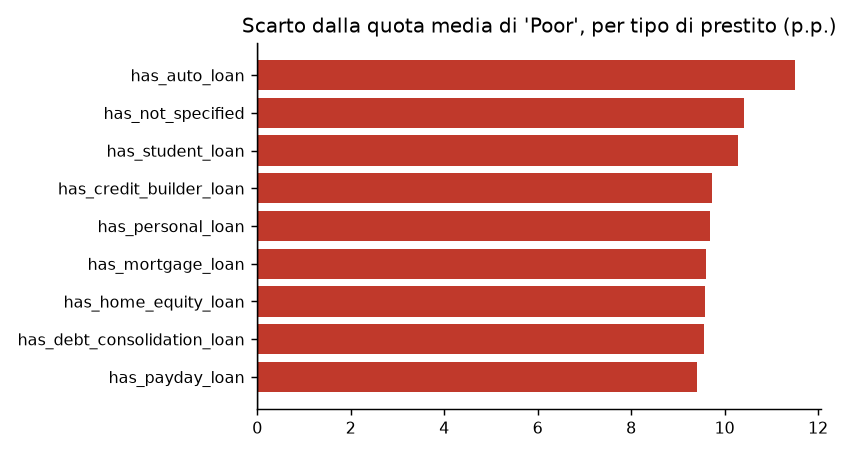

*Figura 3 — Scarto dalla quota media di `Poor` per tipo di prestito posseduto.*

**Risultato negativo.** Tutti i tipi di prestito
mostrano un tasso `Poor` simile (42,7–44,8%, contro una base del 33,3%): il
*tipo* di debito **non discrimina** in questo dataset. Il Payday Loan è
addirittura il meno associato a `Poor` fra i tipi, il contrario di quanto il
dominio farebbe attendere. La scelta del multi-hot resta corretta *a priori*, ma
**empiricamente porta poco segnale** — segno che la semantica di dominio non è
stata rispettata dal generatore sintetico.

### `Occupation` → one-hot, senza bucket "Other"

Il piano prevedeva di raggruppare le categorie rare. **Non ce ne sono**: le 15
occupazioni sono distribuite quasi uniformemente (5.885–6.575 righe ciascuna,
≈750 clienti a categoria). One-hot diretto su 15 categorie.

**Niente target encoding**, per una ragione di coerenza logica: se si usasse
`Occupation` anche per un'analisi di fairness, il target encoding inietterebbe
nella feature la stessa disparità storica che si vuole misurare, rendendo
l'analisi circolare. (In questo progetto `Occupation` non è usata per il
fairness check — §7 — ma la scelta di encoding resta valida a prescindere.)

### `Credit_History_Age` → mesi totali

Parsata da testo ("22 Years and 1 Months") a mesi. **Controllo di coerenza
superato**: per tutti e 12.500 i clienti la differenza fra età della storia
creditizia e indice del mese è costante, cioè incrementa esattamente di 1 al
mese. È l'unica colonna del dataset internamente perfetta.

### Estensioni motivate dall'audit

Due gruppi di feature aggiunte, disattivabili da `config.py`:

**Dispersione (3 feature).** L'audit mostra che gran parte delle colonne è
costante entro cliente — le differenze sono rumore iniettato — mentre restano
davvero *time-varying* utilizzo del credito, ritardi e inquiries. Solo per
quelle si aggiungono `Credit_Utilization_Ratio_std`, `Delay_from_due_date_max`,
`Num_Credit_Inquiries_max`: nel credit risk il **picco** di delinquenza è un
segnale distinto dal suo livello medio.

**Rapporti di dominio (2 feature).** `debt_to_income` = debito residuo / reddito
annuo, `debt_service_ratio` = rata mensile / reddito mensile. Sono i due
indicatori canonici del credito.

Entrambi i gruppi risultano poi marginali (§6): compaiono nelle classifiche
SHAP ma con contributi di un ordine di grandezza inferiore alle feature
canoniche, e **nessuno sopravvive alla selezione L1 più aggressiva** (§4.3).

## 2.7 Analisi esplorativa

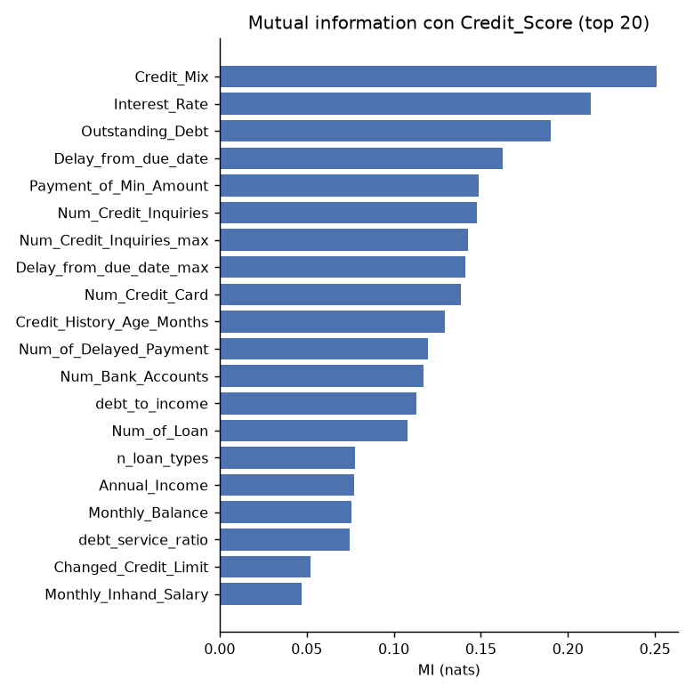

*Figura 4 — Mutual information con il target. Misura quanta informazione una
variabile porta sul target, senza assumere una relazione lineare.*

| Feature | MI (nats) |
|---|---:|
| `Credit_Mix` | 0,2509 |
| `Interest_Rate` | 0,2132 |
| `Outstanding_Debt` | 0,1904 |
| `Delay_from_due_date` | 0,1627 |
| `Payment_of_Min_Amount` | 0,1489 |
| `Num_Credit_Inquiries` | 0,1478 |

Le prime posizioni corrispondono esattamente alle famiglie informative attese da
§1.2: mix di credito, costo del credito, debito, ritardi, richieste. È un
controllo di sanità superato — se in testa ci fosse stata `Occupation`,
avremmo dovuto sospettare un artefatto.

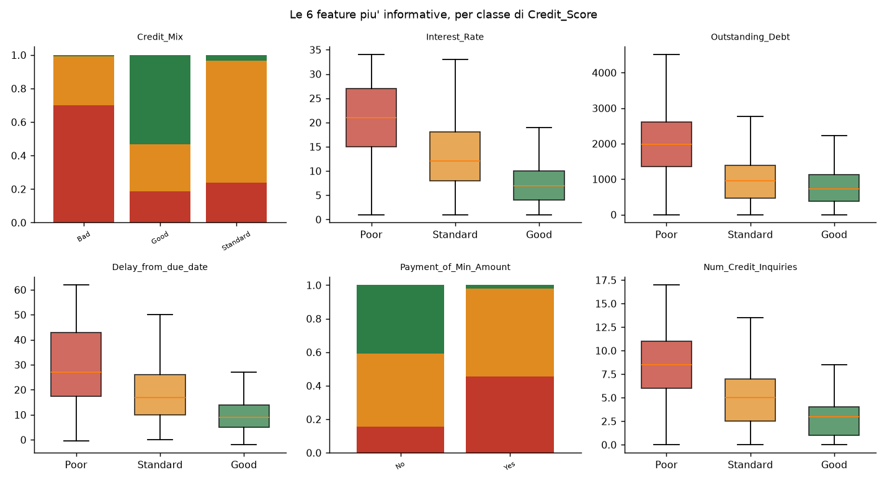

*Figura 5 — Distribuzione delle 6 feature più informative, separatamente per
classe. Le distribuzioni sono nettamente separate per `Credit_Mix`,
`Interest_Rate`, `Outstanding_Debt`.*

### Multicollinearità

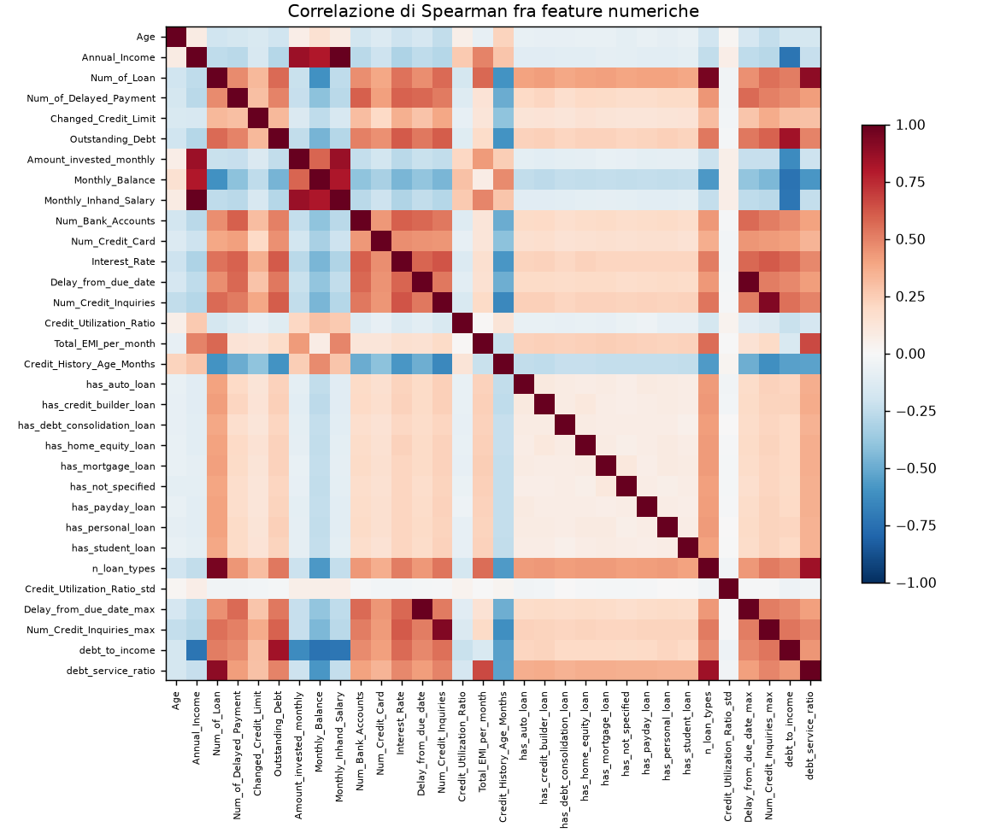

*Figura 6 — Correlazione di Spearman fra feature numeriche.*

Coppie con |ρ| > 0,7 — rilevanti perché condizionano tutta §4.3:

| Coppia | ρ |
|---|---:|
| `Monthly_Inhand_Salary` ~ `Annual_Income` | **0,994** |
| `Delay_from_due_date_max` ~ `Delay_from_due_date` | 0,986 |
| `n_loan_types` ~ `Num_of_Loan` | 0,952 |
| `Num_Credit_Inquiries` ~ `Num_Credit_Inquiries_max` | 0,924 |
| `debt_service_ratio` ~ `Num_of_Loan` | 0,894 |
| `debt_to_income` ~ `Outstanding_Debt` | 0,839 |

> **In parole semplici.** Reddito annuo e stipendio mensile dicono
> essenzialmente la stessa cosa (ρ = 0,994). Per un modello che deve solo
> predire non è un problema. Per un modello di cui vogliamo **interpretare i
> coefficienti** lo è eccome: non si può dire "il reddito conta X" se due
> colonne si contendono lo stesso effetto.

## 2.8 Split

**80/20 stratificato sul target, eseguito dopo l'aggregazione:**

| | Clienti | Poor | Standard | Good |
|---|---:|---:|---:|---:|
| Train pool | 10.000 | 33,29% | 48,89% | 17,82% |
| Test | 2.500 | 33,32% | 48,88% | 17,80% |

La stratificazione garantisce che le proporzioni siano identiche nei due
blocchi, così che la stima finale non sia contaminata da uno sbilanciamento
accidentale.

**Il test set non viene toccato fino a §5.** Tutto il tuning e tutti i confronti
vivono nella cross-validation sul train pool.

---

# 3. Metodo

## 3.1 Scelta della metrica

> **In parole semplici.** L'accuratezza conta quante risposte sono giuste in
> totale. Ma se il 49% dei clienti è `Standard`, un modello scemo che risponde
> sempre "Standard" ottiene il 49% senza aver capito nulla. Il macro-F1 invece
> guarda le tre classi **separatamente** e fa la media: se il modello ignora
> una classe, viene punito.

Formalmente, per ogni classe *k*:

$$F1_k = \frac{2 \cdot P_k \cdot R_k}{P_k + R_k}, \qquad P_k = \frac{TP_k}{TP_k+FP_k}, \qquad R_k = \frac{TP_k}{TP_k+FN_k}$$

e il macro-F1 è la media **non pesata**:

$$\text{macroF1} = \frac{1}{K}\sum_{k=1}^{K} F1_k$$

Il "non pesata" è il punto: ogni classe conta un terzo, indipendentemente da
quanti clienti contiene.

**Perché questa scelta è difendibile nel dominio.** Le tre classi hanno costi
d'errore diversi e di segno opposto:

- classificare come `Good` un cliente realmente `Poor` → perdita attesa su
  credito erogato (costo per il creditore);
- classificare come `Poor` un cliente realmente `Good` → mancato ricavo, e
  soprattutto un danno per il richiedente (credito negato o pricing peggiore).

Senza una matrice di costi fornita dal business, la scelta difendibile è una
metrica che **non privilegia nessuna classe per la sua sola numerosità**.

**Verifica numerica della necessità:** il modello banale che predice sempre
`Standard` ottiene accuratezza **0,4889** e macro-F1 **0,2189**. L'accuratezza
lo fa sembrare mediocre; il macro-F1 lo qualifica correttamente come inutile.

> **La metrica è stata fissata prima di addestrare qualunque modello.**
> Sceglierla dopo, guardando chi performa meglio, è una delle forme più comuni e
> meno visibili di autoinganno metodologico.

## 3.2 Trattamento dello sbilanciamento

> **In parole semplici.** Ci sono meno clienti `Good` che `Standard`. Due modi
> di rimediare: (a) dire al modello "sbagliare un `Good` ti costa di più", (b)
> inventare clienti `Good` finti per pareggiare i numeri. Abbiamo scelto (a).

**Class weighting.** Ogni campione riceve un peso inversamente proporzionale
alla frequenza della sua classe:

$$s_k = \frac{n}{K \cdot n_k}$$

| Classe | $n_k$ | quota | peso $s_k$ |
|---|---:|---:|---:|
| Poor | 3.329 | 33,3% | 1,001 |
| Standard | 4.889 | 48,9% | 0,682 |
| Good | 1.782 | 17,8% | **1,871** |

Un cliente `Good` pesa **2,7 volte** un cliente `Standard`.

**Perché non SMOTE.** SMOTE genera esempi sintetici interpolando fra campioni
esistenti. Spiegare con SHAP (§6) un modello addestrato in parte su clienti che
non esistono è in contraddizione diretta con l'obiettivo di governance del
progetto: la spiegazione di un rifiuto non può poggiare su dati inventati. La
scelta è di coerenza, non di performance.

**Verifica a posteriori** (§8.2): il class weighting guadagna 0,47 punti di
macro-F1 **a parità esatta di accuratezza**. L'ipotesi implicita nella scelta
regge.

## 3.3 Protocollo di validazione

```
100.000 righe
    │  cleaning + aggregazione per cliente
    ▼
12.500 clienti
    │  split stratificato 80/20
    ├──────────────────────────────┐
    ▼                              ▼
TRAIN POOL (10.000)          TEST (2.500)
    │                              │
    │ Stratified 5-fold CV         │  intoccabile
    │  • Step 0 (§4.1)             │  fino a §5
    │  • tuning Filone A (§4.2)    │
    │  • tuning Filone B (§4.3)    │
    │  • ablation (§8)             │
    ▼                              ▼
modelli finali  ──────────►  valutazione UNA VOLTA
```

**Stratified 5-fold CV.** Il train pool è diviso in 5 parti con le stesse
proporzioni di classe; si allena su 4 e si valuta sulla quinta, ruotando.

**Tre proprietà del protocollo, tutte verificate nel codice:**

1. **I fold sono identici per tutti i modelli** (`evaluation.make_cv()` con seed
   fisso). Non è un dettaglio: è un **confronto appaiato**. Se ogni modello
   ricevesse partizioni diverse, parte delle differenze osservate sarebbe
   dovuta a quali clienti sono capitati dove. Con gli stessi fold quella
   componente si cancella — essenziale quando i primi tre modelli distano meno
   di un punto.
2. **Ogni modello si allena in modo indipendente.** `GridSearchCV` clona lo
   stimatore prima di ogni fit: nessun warm start, nessuno stato condiviso. In
   totale, nello step04: **121 configurazioni × 5 fold = 605 addestramenti**.
3. **Il preprocessing è dentro la pipeline**, quindi imputer e scaler sono
   fittati **solo sui fold di training**. Fittare lo scaler su tutto il pool
   prima della CV farebbe filtrare informazione dal fold di validazione — una
   forma di leakage sottile e frequentissima.

## 3.4 Preprocessing

`features.make_preprocessor` costruisce un `ColumnTransformer`:

| Tipo di colonna | Trasformazioni |
|---|---|
| Numeriche | imputazione mediana → standardizzazione (opzionale) |
| Categoriali | imputazione moda → one-hot (`handle_unknown="ignore"`) |

**Quando serve la standardizzazione.** Solo per i modelli che dipendono dalla
scala: lineari penalizzati (L1/L2 penalizzano i coefficienti — senza scala
comune la penalità non è confrontabile fra feature) e SVM (il kernel RBF si
basa su distanze euclidee, quindi una feature su scala grande dominerebbe il
kernel). Per gli alberi è inerte: uno split su `x < 3` e uno su `x' < 0,5` dopo
standardizzazione partizionano gli stessi campioni.

## 3.5 Funzioni obiettivo e nozioni di complessità

> **In parole semplici.** Ogni modello ha una "regola per sbagliare il meno
> possibile" durante l'allenamento. Ma questa regola **non è** il macro-F1 con
> cui poi lo giudichiamo. Sono due cose diverse, ed è importante non
> confonderle.

Nel progetto convivono **tre ottimizzazioni annidate**:

| Livello | Cosa ottimizza | Su cosa | Dove |
|---|---|---|---|
| **1. Addestramento** | loss + penalità | parametri (`w`, split) | dentro `.fit()` |
| **2. Selezione iperparametri** | **macro-F1** in CV | `C`, `max_depth`, … | `GridSearchCV` |
| **3. Scelta del modello** | regola 1-SE | famiglia di modello | §4.2 |

**Il macro-F1 non è mai una loss.** Non è differenziabile (dipende da un
`argmax`, quindi ha gradiente nullo quasi ovunque) e non è decomponibile per
campione: non esiste $\ell$ tale che $\text{macroF1} = \sum_i \ell(y_i,\hat y_i)$,
perché precision e recall sono rapporti calcolati sull'intero insieme. Vive solo
ai livelli 2 e 3, come **criterio di selezione**.

### Regressione logistica (L2 e L1)

Unico caso con funzione obiettivo esplicita e globale:

$$\min_{w,b} \underbrace{\frac{1-\rho}{2}\lVert w\rVert_2^2 + \rho\lVert w\rVert_1}_{\text{penalità}} + C\sum_{i=1}^{n} s_i \underbrace{\big(-\log p_w(y_i \mid x_i)\big)}_{\text{cross-entropy}}$$

- **Loss**: cross-entropy multinomiale con $p_w$ softmax. Convessa e
  differenziabile → esiste un minimo globale, raggiungibile con `lbfgs`.
- $s_i$: peso di classe (§3.2).
- $\rho$ = `l1_ratio`: 0 → L2 pura, 1 → L1 pura (richiede solver `saga`).
- **Avvertenza:** `C` moltiplica la loss, non la penalità. Se a lezione si scrive
  $\text{loss} + \lambda R(w)$, allora $C \approx 1/\lambda$: **`C` grande =
  regolarizzazione debole**, il contrario dell'intuizione.

Decomposizione numerica dell'obiettivo sul train pool:

| | $C\sum s_i\ell_i$ | $\frac12\lVert w\rVert^2$ | peso della penalità | $\lVert w\rVert_2$ |
|---|---:|---:|---:|---:|
| `C = 0,01` | 66,1 | 1,8 | 2,67% | 1,91 |
| `C = 10` | 65.205,1 | 5,8 | 0,01% | 3,41 |

Con `C=10` la penalità è numericamente irrilevante e i coefficienti crescono.

**Terminologia.** Per un problema di *classificazione* i termini corretti sono
"Logistic Regression con penalità L2" e "... L1". *Ridge* e *Lasso* sono i nomi
degli analoghi nella regressione lineare continua e non vanno usati qui.

### Albero decisionale

**Non esiste una loss, né una funzione obiettivo globale.** L'albero usa un
**criterio di impurità** valutato localmente:

$$H_{\text{gini}}(S) = 1-\sum_k p_k^2 \qquad H_{\text{entropia}}(S) = -\sum_k p_k \log_2 p_k$$

e ad ogni nodo sceglie lo split che massimizza la riduzione di impurità:

$$\Delta H = H(S) - \frac{n_L}{n}H(S_L) - \frac{n_R}{n}H(S_R)$$

con conteggi **pesati** quando `class_weight` è attivo.

È un algoritmo **greedy**: ottimizza uno split alla volta, senza garanzia di
ottimalità globale (trovare l'albero ottimo è NP-hard). Differenza concettuale
sostanziale rispetto alla regressione logistica.

### Random Forest

**Nessuna funzione obiettivo, nemmeno locale.** Ogni albero minimizza la propria
impurità su un campione bootstrap e un sottoinsieme casuale di feature; la
foresta è la **media** delle probabilità.

Il principio è **statistico, non variazionale**: alberi profondi hanno bias
basso e varianza alta; mediare $B$ predittori decorrelati riduce la varianza
senza toccare il bias. Da cui:

> **`n_estimators` non è un parametro di complessità.** Aumentare gli alberi non
> porta mai a overfitting: la varianza scende monotonicamente e satura. È un
> parametro di costo computazionale. I parametri di complessità veri sono
> `max_depth`, `min_samples_leaf`, `max_features`.

### Gradient Boosting (istogrammi)

Loss esplicita (cross-entropy), minimizzata con **discesa del gradiente nello
spazio delle funzioni**:

$$F_m(x) = F_{m-1}(x) + \nu \cdot h_m(x)$$

dove $h_m$ approssima il gradiente negativo e $\nu$ = `learning_rate` è lo
*shrinkage*. Regolarizzazione su tre fronti: `learning_rate`, `max_iter`
(numero di termini), `l2_regularization` sui valori delle foglie.

### SVM (lineare e RBF)

Loss **hinge** invece di log-loss:
$\ell(y, f(x)) = \max(0, 1 - y f(x))$, con penalità L2. Il kernel RBF
$K(x,x') = \exp(-\gamma\lVert x-x'\rVert^2)$ mappa implicitamente in uno spazio
a dimensione infinita.

Non erano nel piano iniziale; sono stati aggiunti come verifica (§4.1, §4.2).

### MNLogit (`statsmodels`)

Unico punto con **massima verosimiglianza pura**:

$$\max_\beta \ \ell(\beta) = \sum_i \log p_\beta(y_i \mid x_i) \qquad \text{nessuna penalità, nessun peso}$$

Non è una dimenticanza: **è il motivo per cui quello step esiste**. Gli
stimatori penalizzati sono distorti per costruzione — la penalità li tira verso
zero — e i loro errori standard classici non sono validi. I p-value hanno senso
solo su uno stimatore non penalizzato.

### Riassunto

| Modello | Loss | Penalità | Complessità controllata da | Ottimo globale? |
|---|---|---|---|---|
| Logistic L2 | cross-entropy pesata | $\frac12\lVert w\rVert^2$ | `C` | Sì (convessa) |
| Logistic L1 | cross-entropy pesata | $\lVert w\rVert_1$ | `C` (→ sparsità) | Sì (convessa) |
| Linear SVC | hinge | $\lVert w\rVert^2$ | `C` | Sì (convessa) |
| SVC RBF | hinge | $\lVert w\rVert^2$ | `C`, `gamma` | Sì (nel duale) |
| Albero | — (impurità) | — | `max_depth`, `min_samples_leaf` | No (greedy) |
| Random Forest | — (impurità) | — | `max_depth`, `max_features` | No |
| Gradient Boosting | cross-entropy | L2 sulle foglie + shrinkage | `learning_rate`, `max_iter` | No |
| MNLogit | log-verosimiglianza | nessuna | — (è inferenza) | Sì (MLE) |
| **macro-F1** | **non è una loss** | — | — | usato ai livelli 2–3 |

### I livelli 1 e 2 non sono d'accordo

Griglia della logistica L2, stesso modello, stessa CV:

| `C` | log-loss (min. in training) | macro-F1 (max. in selezione) | accuracy |
|---:|---:|---:|---:|
| 0,10 | 0,7052 | 0,7104 | 0,7165 |
| **0,30** | **0,7050** ← minimo | 0,7110 | 0,7171 |
| 1,00 | 0,7051 | 0,7111 | 0,7171 |
| **10,0** | 0,7052 | **0,7115** ← massimo | **0,7176** |

> **Il `C` che minimizza la loss non è il `C` che massimizza la metrica.** Il
> livello 2 sceglie `C=10`, un modello *peggiore* secondo la funzione
> effettivamente minimizzata in addestramento. Le differenze qui sono minime, ma
> il fenomeno è reale: la metrica di selezione è una scelta di modellazione.

## 3.6 Regole di decisione

Entrambe dichiarate **prima** di vedere i risultati, e implementate una volta
sola in `evaluation.py` per impedire che divergano.

### Criterio della zona grigia (Step 0)

> **In parole semplici.** Prima di spendere ore a ottimizzare modelli
> complicati, facciamo una prova veloce: se il modello semplice va quasi come
> quello complicato, abbiamo finito. Se va molto peggio, sappiamo che serve
> complessità. Se va "un po' peggio"… la prova veloce non ci ha detto nulla e
> dobbiamo fare quella lenta.

Criterio: sia $\Delta$ = macro-F1 del miglior non lineare − macro-F1 del miglior
lineare, sui **modelli a default**.

- $\Delta < 3$ punti → problema **lineare-sufficiente** → Filone A = logistica L2, fine.
- $3 \le \Delta < 5$ → **zona grigia**: la diagnosi non è conclusiva, si procede al tuning completo.
- $\Delta \ge 5$ → non linearità necessaria.

La soglia 3–5 è una soglia **pratica**, di dominio: "la differenza è abbastanza
grande da valere la complessità?". Non è un test statistico.

### La regola 1-SE (Filone A)

> **In parole semplici.** Il punteggio in cross-validation non è un numero
> esatto: cambia un po' a seconda di quali clienti finiscono in quale gruppo.
> L'errore standard misura questo tremolio. La regola dice: fra tutti i modelli
> che stanno "dentro il tremolio" dal migliore, prendi **il più semplice**.

Sia $\text{SE} = \text{sd}_{\text{fold}} / \sqrt{k}$ l'errore standard della
media dei $k$ fold. Allora:

$$\mathcal{M}^\star = \arg\min_{m \,\in\, \{m \,:\, \text{CV}(m) \ge \max_j \text{CV}(j) - \text{SE}\}} \ \text{complessità}(m)$$

È un obiettivo **lessicografico**: prima il vincolo di performance, poi si
minimizza la complessità. Non è una somma pesata, quindi nessuno deve tarare un
$\lambda$ fra accuratezza e semplicità.

L'ordine di complessità è dichiarato a priori in `models.COMPLEXITY_RANK` e
ordinato per **costo di interpretabilità**, non per numero di parametri:

```
Logistic L1 < Logistic L2 < Linear SVC < Albero < Random Forest
            < Gradient Boosting < SVC RBF
```

Le posizioni meno ovvie: la Linear SVC sta dopo la logistica perché non produce
probabilità native, quindi è meno utilizzabile per motivare una decisione; la
SVC RBF sta in fondo, dopo gli ensemble di alberi, perché per RF e boosting
esiste TreeSHAP (esatto e veloce) mentre per un kernel RBF servirebbe KernelSHAP
(approssimato e ordini di grandezza più costoso).

---

# 4. Risultati

## 4.1 Modelli di riferimento: il problema richiede non linearità? (Q1)

Modelli a **setting di default**, stessa CV, stessa metrica. Lo scopo è
diagnostico, non competitivo: si vuole rispondere a una domanda al costo più
basso possibile.

| Modello | macro-F1 (CV) | ± sd | bal. acc. | accuracy |
|---|---:|---:|---:|---:|
| Random Forest | **0,7415** | 0,0081 | 0,7808 | 0,7478 |
| Gradient Boosting (hist) | 0,7337 | 0,0056 | 0,7593 | 0,7422 |
| Decision Tree (depth 4) | 0,7266 | 0,0096 | 0,7748 | 0,7306 |
| SVC (kernel RBF) | 0,7193 | 0,0102 | 0,7653 | 0,7260 |
| Logistic Regression (L2) | 0,7111 | 0,0117 | 0,7549 | 0,7171 |
| Linear SVC | 0,7072 | 0,0114 | 0,7497 | 0,7148 |
| Dummy (stratified) | 0,3362 | 0,0130 | 0,3363 | 0,3840 |

**Gap lineare / non lineare: 3,04 punti** → **zona grigia**.

Il criterio dichiarato a priori non produce una risposta: la decisione viene
rinviata a §4.2, su modelli tutti tunati con lo stesso budget.

Due osservazioni già a questo stadio:

- **Un albero a profondità 4 batte la regressione logistica di 1,5 punti.** La
  struttura utile del problema non è lineare, ma è **poco profonda** — un
  indizio forte a favore del Filone B.
- **`Linear SVC` (0,7072) ≈ `Logistic Regression` (0,7111).** Due loss diverse
  — hinge contro log-loss — sulla stessa classe di ipotesi lineari danno lo
  stesso risultato. Conferma che il limite dei modelli lineari qui è **la
  linearità**, non la scelta della funzione di perdita.

> **Nota sull'albero a profondità 4 in questa tabella.** Il valore 4 è qui
> **fissato a mano**, non ottimizzato: serve un riferimento "albero leggibile"
> per la diagnosi. Lasciato libero (§4.2) l'ottimo è 6.

## 4.2 Filone A — il modello più semplice sufficiente (Q2)

Tutti i candidati tunati con `GridSearchCV` su macro-F1, stessi fold.

| Modello | macro-F1 | SE | n. config | iperparametri ottimi |
|---|---:|---:|---:|---|
| **Random Forest** | **0,7440** | 0,0036 | 36 | `max_depth=12, max_features=0.4, min_samples_leaf=1, n_estimators=300` |
| Gradient Boosting | 0,7373 | 0,0044 | 24 | `lr=0.05, max_leaf_nodes=31, max_iter=200, l2=1.0` |
| Decision Tree | 0,7355 | 0,0051 | 28 | `max_depth=6, min_samples_leaf=100` |
| SVC (RBF) | 0,7229 | 0,0046 | 20 | `C=10, gamma=0.01` |
| Logistic Regression (L2) | 0,7115 | 0,0053 | 7 | `C=10` |
| Linear SVC | 0,7074 | 0,0050 | 6 | `C=0.03` |

**Applicazione della regola 1-SE:** soglia = 0,7440 − 0,0036 = **0,7404**.
Nessun modello più semplice la raggiunge.

> ### Filone A = Random Forest
> Il problema **non** è lineare-sufficiente.

### Robustezza della regola di selezione

Con 5 fold su 10.000 clienti l'SE è molto piccolo (0,0036) e la regola 1-SE
**degenera quasi nel "vince il migliore"**. Sensibilità alla soglia:

| Soglia | Valore | Modelli ammessi |
|---|---:|---|
| 1 SE | 0,7404 | Random Forest |
| 2 SE | 0,7368 | + Gradient Boosting |
| **3 SE** | **0,7332** | **+ Decision Tree** |

Serve una soglia a **3 SE (≈1 punto)** perché l'albero singolo rientri. La
regola seleziona un solo modello perché l'SE è piccolo, non perché gli altri
siano molto peggiori: il Random Forest batte l'albero tunato di **0,85 punti**,
differenza reale ma modesta.

### Quantificazione del rischio di selezione

Valutando 121 configurazioni sugli stessi 5 fold e tenendo la migliore, si sta
in parte **selezionando rumore**. Se tutti i modelli fossero equivalenti, il
massimo atteso di $N$ estrazioni di rumore sarebbe $\text{SE}\sqrt{2\ln N}$:

| $N$ | gonfiamento massimo atteso |
|---:|---:|
| 36 (griglia RF) | 0,96 punti |
| 121 (step04 completo) | 1,11 punti |

**Ma il gonfiamento dipende da quanti candidati sono *vicini* al vincitore, non
dal totale.** Le SVM stanno 2–3 punti sotto: non hanno possibilità di vincere
per fortuna, quindi aggiungono ≈0 bias. Il rischio è concentrato nei primi tre
(entro 0,9 punti), dove la *classifica* è in parte rumore. La conclusione che il
progetto usa — "il problema non è lineare-sufficiente" — poggia invece su un
divario di **3,2 punti** fra RF e logistica, ben fuori dal rumore.

La risposta rigorosa sarebbe una **nested CV**, che stima l'intera procedura di
selezione; costerebbe 5× lo step04. Il test set held-out (§5) serve allo stesso
scopo a costo molto minore.

> **Verifica successiva (§8.3-ter).** Su un dataset più grande è stato
> possibile aggiungere un terzo blocco dedicato alla sola selezione. Il
> gonfiamento teorico stimato qui **non si è materializzato**: selezionare sulla
> CV e selezionare su un blocco mai visto portano allo stesso modello, e la CV
> risulta *conservativa* di 1,16 punti anziché ottimista.

## 4.3 Filone B — massimizzazione dell'interpretabilità (Q3)

Vincolo: il modello deve essere **leggibile da un umano senza strumenti
aggiuntivi**. Due candidati, confrontati direttamente.

### B1 — Logistic Regression con penalità L1

> **In parole semplici.** La penalità L1 ha una proprietà speciale: non si
> limita a rimpicciolire i coefficienti, li porta **esattamente a zero**. Quindi
> sceglie da sola quali variabili tenere.

Selezionare `C` sul solo massimo di macro-F1 **vanificherebbe lo scopo**: a
`C=1` sopravvivono 57 feature su 58. Regola coerente con l'obiettivo del filone:
si prende il `C` **più parsimonioso** che resti entro 1 SE dal migliore.

| `C` | feature attive | macro-F1 (CV) |
|---:|---:|---:|
| **0,002** | **11** | **0,7085** |
| 0,005 | 12 | 0,7066 |
| 0,010 | 17 | 0,7082 |
| 0,030 | 27 | 0,7089 |
| 0,100 | 43 | 0,7106 |
| 0,300 | 53 | 0,7102 |
| 1,000 | 57 | 0,7111 |

Soglia = 0,7111 − 0,0054 = 0,7057 → **`C = 0,002`, 11 feature**.


*Figura 7 — Trade-off parsimonia/performance. Ogni punto è un valore di `C`.*

> **Da 57 a 11 feature si perdono 0,26 punti di macro-F1.** L'80% delle
> variabili non serve.

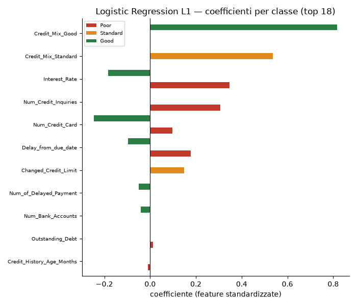

*Figura 8 — Coefficienti L1 per classe. Feature standardizzate, quindi
direttamente confrontabili fra loro.*

| Feature | Poor | Standard | Good |
|---|---:|---:|---:|
| `Credit_Mix_Good` | 0 | 0 | **+0,817** |
| `Credit_Mix_Standard` | 0 | +0,537 | 0 |
| `Interest_Rate` | **+0,347** | 0 | −0,183 |
| `Num_Credit_Inquiries` | +0,306 | 0 | 0 |
| `Num_Credit_Card` | +0,097 | 0 | −0,245 |
| `Delay_from_due_date` | +0,178 | 0 | −0,096 |
| `Changed_Credit_Limit` | 0 | +0,148 | 0 |
| `Num_of_Delayed_Payment` | 0 | 0 | −0,049 |
| `Num_Bank_Accounts` | 0 | 0 | −0,042 |
| `Outstanding_Debt` | +0,013 | 0 | 0 |
| `Credit_History_Age_Months` | −0,011 | 0 | 0 |

Le 11 superstiti corrispondono **esattamente** alle famiglie informative di uno
score reale (§1.2). **Nessuna delle feature ingegnerizzate** — dispersione,
rapporti di dominio, multi-hot dei prestiti — sopravvive alla L1 aggressiva.

### B2 — Albero decisionale a profondità vincolata

Griglia ristretta a `max_depth ∈ {3, 4}` per **vincolo di progetto**: un albero
più profondo non è più leggibile su una pagina. Dentro il vincolo, la scelta è
empirica via CV.

Ottimo: `max_depth=4, min_samples_leaf=100, criterion=entropy` →
**macro-F1 CV 0,7272** (SE 0,0046), contro 0,7085 della L1: **+1,9 punti**.

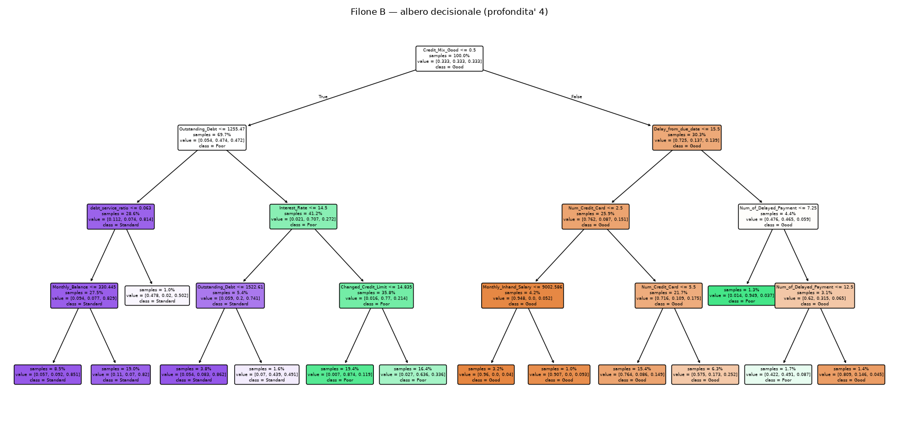

*Figura 9 — Il modello del Filone B per intero: 14 foglie, 27 nodi, profondità
4. Questo è tutto il modello — non una sua approssimazione.*

**Come si legge.** La prima domanda è `Credit_Mix_Good`: il mix di credito è
buono? Se sì, il ramo si biforca su `Outstanding_Debt` (quanto debito residuo);
se no, su `Delay_from_due_date` (quanto ritardo nei pagamenti). È esattamente la
sequenza di domande che porrebbe un analista del credito.

> ### Filone B = albero decisionale (profondità 4)
> Domina la L1 sia in performance sia in leggibilità: non serve SHAP per
> spiegarlo.

**Il costo del vincolo di interpretabilità**, quantificato: l'albero lasciato
libero (§4.2) raggiunge 0,7355 a profondità 6; vincolato a profondità 4 si ferma
a 0,7272. **Il vincolo costa 0,83 punti.**

### B3 — Diagnostica inferenziale (statsmodels)

> **In parole semplici.** Fin qui abbiamo chiesto "quanto predice bene?". Ora
> chiediamo "questi effetti sono reali o potrebbero essere caso?" — cioè i
> p-value. Ma i p-value si possono leggere solo se le variabili non si
> sovrappongono troppo fra loro.

Eseguita **dopo** la selezione L1, sul solo sottoinsieme ridotto. Prima di
guardare i p-value, due passaggi obbligatori:

**1. Collinearità strutturale, rimossa a priori.** `n_loan_types` è per
costruzione la somma esatta delle dummy `has_*`. Lasciarla dentro rende la
matrice singolare e manda **tutti** i VIF a infinito. Va rimossa perché è una
dipendenza esatta, non perché ha VIF alto.

**2. Categoria di riferimento** per ogni variabile categoriale (le dummy
one-hot complete sono linearmente dipendenti).

Il *Variance Inflation Factor* misura di quanto la varianza di un coefficiente è
gonfiata dalla correlazione con gli altri regressori:
$\text{VIF}_i = 1/(1-R_i^2)$, dove $R_i^2$ è dalla regressione della feature $i$
su tutte le altre.

| Feature | VIF |
|---|---:|
| `Outstanding_Debt` | 2,67 |
| `Interest_Rate` | 2,45 |
| `Num_Credit_Inquiries` | 2,20 |
| `Credit_History_Age_Months` | 2,10 |
| `Num_Bank_Accounts` | 2,03 |
| `Delay_from_due_date` | 2,03 |
| `Num_of_Delayed_Payment` | 1,99 |
| `Num_Credit_Card` | 1,54 |
| `Changed_Credit_Limit` | 1,44 |
| `Credit_Mix_Standard` | 1,19 |

**VIF massimo 2,67**, ben sotto la soglia convenzionale di 5–10: nessuna potatura
necessaria, i p-value sono leggibili.

**Per contrasto**, sul set completo `Monthly_Inhand_Salary` ha VIF **360** e
`Annual_Income` **352** (ρ = 0,994). È esattamente il motivo per cui l'inferenza
classica va fatta *dopo* la selezione, non prima.

**Risultati MNLogit** (baseline `Poor`, n = 10.000):
pseudo-R² = **0,3286**, log-likelihood = −6871,0, tutti i coefficienti tranne uno
significativi a p < 0,05. Segni coerenti col dominio: `Interest_Rate`,
`Delay_from_due_date`, `Num_Credit_Inquiries`, `Num_Credit_Card` spingono verso
`Poor`; `Credit_History_Age_Months` verso `Standard`/`Good`.

**Anomalia di segno.** `Num_of_Delayed_Payment` ha coefficiente
**positivo** verso `Standard` e `Good` (p < 0,001), cioè il segno "sbagliato". È
un effetto di **soppressione** dovuto alla correlazione con
`Delay_from_due_date` (che ha segno corretto e magnitudo maggiore):
condizionatamente all'*entità* del ritardo, il *numero* di ritardi correla con
l'essere un cliente attivo. Il VIF basso (1,99) **non protegge da questo**: il
VIF misura la varianza gonfiata, non l'interpretabilità causale del segno.

**Cautela ulteriore.** Fare inferenza *dopo* una selezione guidata dai dati
è a sua volta ottimistico (*post-selection inference*). È un limite dichiarato,
non risolto qui.

---

# 5. Valutazione finale sul test set (Q4)

Il test set viene toccato **adesso**, per la prima volta, dopo che entrambi i
modelli finali erano già stati scelti e tunati sulla sola CV.

| | macro-F1 CV | **macro-F1 TEST** | accuracy | F1 Poor | F1 Standard | F1 Good |
|---|---:|---:|---:|---:|---:|---:|
| **Filone A** — Random Forest | 0,7440 | **0,7617** | 0,7688 | 0,798 | 0,777 | 0,710 |
| **Filone B** — Decision Tree (d=4) | 0,7272 | **0,7459** | 0,7508 | 0,780 | 0,749 | 0,709 |

**La stima in CV ha retto**: lo scarto CV → test è +0,0177 e +0,0188, coerente e
nella direzione attesa (il modello finale è rifittato su 10.000 clienti invece
che su 8.000).


*Figura 10 — Matrici di confusione sul test set, normalizzate per riga.*

> ## Il risultato centrale
> **Il prezzo della piena trasparenza è 1,58 punti di macro-F1**
> (0,7617 → 0,7459).
>
> Passare da un ensemble di 300 alberi profondi 12 — **117.956 foglie
> complessive** — a **un singolo albero di profondità 4 con 14 foglie**,
> leggibile su una pagina e spiegabile a un cliente senza strumenti aggiuntivi,
> costa l'1,6% in metrica. **8.400 volte più foglie per 1,58 punti.**
> Sulla classe `Good` la differenza è di 0,1 punti: praticamente nulla.

Per un'applicazione classificata **ad alto rischio** dall'EU AI Act, con obbligo
di motivare i rifiuti, 1,58 punti vanno confrontati col costo di dover
spiegare, documentare e difendere un ensemble. **Questo report raccomanda il
modello del Filone B**, e considera il Filone A come benchmark che quantifica
quanto si sta lasciando sul tavolo.

## 5.1 Struttura degli errori

Matrice di confusione out-of-fold (Filone A, % per riga):

| reale ↓ / predetto → | Poor | Standard | Good |
|---|---:|---:|---:|
| **Poor** | 78,9 | 10,4 | 10,7 |
| **Standard** | 16,3 | **67,0** | 16,8 |
| **Good** | 2,2 | 8,1 | 89,7 |

L'errore si concentra su `Standard`, la classe intermedia. Confusione
`Poor` ↔ `Good` quasi assente (2,2%): **il modello non sbaglia mai di due
categorie**, il che nel credito è la proprietà che conta di più.

**Quanto di questo errore è rumore del label?** I clienti classificati
correttamente hanno un accordo medio col proprio label mensile dell'**86,3%**;
quelli classificati male, del **78,6%**. Una parte dell'errore residuo non è
migliorabile: è ambiguità del target, non del modello.

---

# 6. Interpretabilità (Q5)

> **In parole semplici.** SHAP risponde alla domanda: "per *questo* cliente,
> quanto ha pesato ciascuna informazione nella decisione?". L'idea viene dalla
> teoria dei giochi: si tratta ogni variabile come un giocatore in squadra e si
> calcola quanto ciascuno ha contribuito al risultato finale.

I valori di Shapley sono l'unica attribuzione che soddisfa simultaneamente
efficienza (i contributi sommano alla predizione), simmetria, dummy e
additività. Per i modelli ad albero esiste **TreeSHAP**, che li calcola in modo
esatto e in tempo polinomiale.

Le spiegazioni sono calcolate sul test set: sono un artefatto **post-hoc** e non
entrano in nessuna decisione di modellazione.

## 6.1 Attribuzione globale


*Figura 11 — Importanza globale: media di |valore SHAP| per classe.*

| Feature | \|SHAP\| medio |
|---|---:|
| `Credit_Mix_Good` | 0,0979 |
| `Outstanding_Debt` | 0,0562 |
| `Interest_Rate` | 0,0398 |
| `Payment_of_Min_Amount_Yes` | 0,0361 |
| `Credit_Mix_Standard` | 0,0328 |
| `Payment_of_Min_Amount_No` | 0,0324 |
| `Delay_from_due_date` | 0,0288 |

Il modello si regge su **mix di credito, debito residuo, tasso applicato,
pagamento del minimo e ritardi**: le famiglie canoniche del credit scoring. Le
feature ingegnerizzate (`debt_to_income` 0,0126, `Delay_from_due_date_max`
0,0118) compaiono ma con contributi di un ordine di grandezza inferiore.

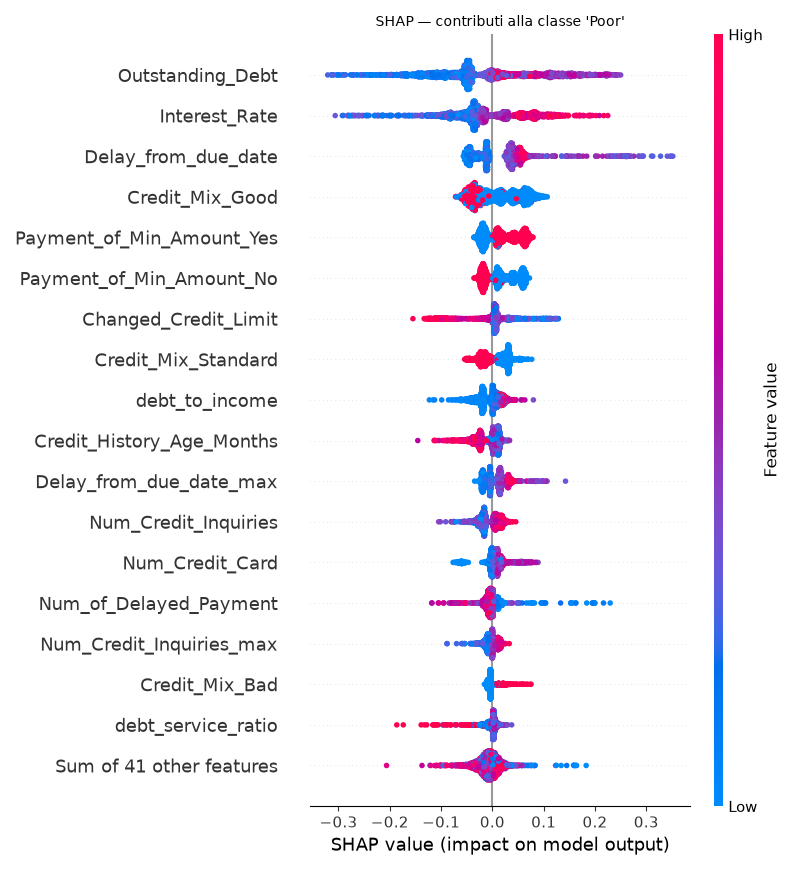

*Figura 12 — Beeswarm sulla classe `Poor`: ogni punto è un cliente, la posizione
è il contributo SHAP, il colore il valore della feature. Mostra non solo
**quanto** conta una variabile, ma **in che direzione**.*

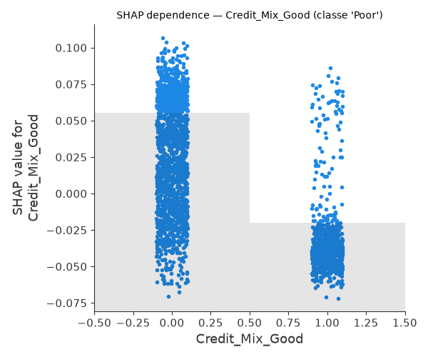

*Figura 13 — Dependence plot: come cambia il contributo al variare del valore
della feature.*

**Avvertenza.** Le due feature più importanti sono in parte *output* del processo
che si sta replicando. `Credit_Mix` è una valutazione di bureau, `Interest_Rate` è il
prezzo applicato *dopo* aver valutato il merito creditizio. Il loro peso va
letto come coerenza interna col sistema di scoring esistente, non come scoperta
causale sul rischio. In produzione andrebbero verificate contro la disponibilità
effettiva al momento della decisione.

## 6.2 Attribuzione locale: tre casi rappresentativi

Scelti per rappresentare i casi d'uso reali di un ufficio crediti.

| Caso | Cliente | Reale | Predetto | p |
|---|---|---|---|---:|
| A — corretto | `CUS_0x7745` | Poor | Poor | 0,98 |
| B — errore "sicuro" | `CUS_0x7cd3` | Standard | Poor | 0,98 |
| C — borderline | `CUS_0x613c` | Standard | Poor | 0,49 |

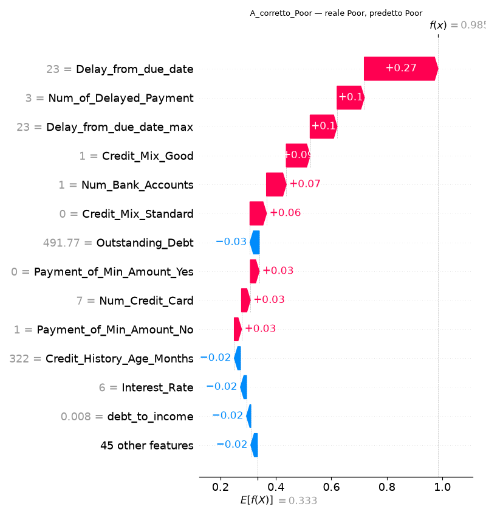

*Figura 14 — Caso A: predizione corretta ad alta confidenza. `Delay_from_due_date`
(+0,266) domina, seguito da `Num_of_Delayed_Payment` (+0,098).*


*Figura 15 — Caso B: errore ad alta confidenza. Gli stessi cinque driver del
caso A, con magnitudo quasi identiche (`Delay_from_due_date` +0,286).*

> **Il confronto A vs B è il risultato più istruttivo di tutta la sezione.** Due
> clienti con **spiegazioni quasi identiche** ricevono label reali diversi. Non
> è un errore correggibile con più capacità del modello: sono due profili di
> rischio sovrapposti a cui il processo originale ha assegnato giudizi diversi.
> È il rumore del label di §2.4, visto su un singolo cliente.

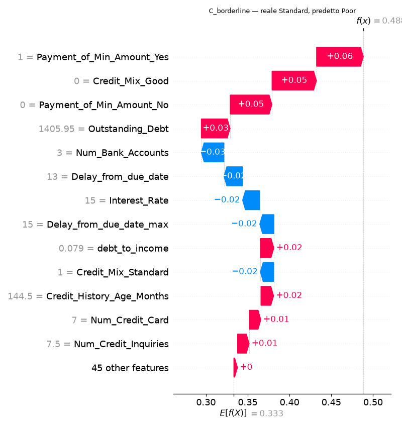

*Figura 16 — Caso C: zona d'incertezza. Margine 0,00 fra prima e seconda classe,
contributi tutti piccoli (<0,06) e di segno opposto.*

Operativamente, il caso C è quello che andrebbe instradato a **revisione
umana**. La "sorveglianza umana" richiesta dall'EU AI Act trova qui un criterio
quantitativo: instradare a revisione i casi con margine sotto una soglia.

---

# 7. Fairness (Q6)

**Perimetro:** solo **età** (binned) come proxy di gruppo protetto. È l'unico
attributo protetto (o suo proxy diretto) presente nel dataset — il perimetro è
una conseguenza dei dati, non una scelta di comodo.

`Occupation` è **esplicitamente esclusa**, per due ragioni: evitare la
circolarità con l'encoding (§2.6) e perché dopo l'aggregazione i sottogruppi
occupazionali sarebbero troppo piccoli per stime stabili.

Metriche calcolate sulle predizioni **out-of-fold** del train pool (n = 10.000),
che danno intervalli più stretti del test set (n = 2.500). Entrambe le viste
sono riportate nel codice; le conclusioni coincidono.

## 7.1 Demographic parity

> **In parole semplici.** Il modello dà la stessa quota di giudizi negativi a
> giovani e meno giovani? E se no, è perché nei dati i giovani sono davvero più
> rischiosi, o perché il modello ci mette del suo?

| Fascia | n | Tasso reale `Poor` | Tasso **predetto** `Poor` | Tasso reale `Good` | Tasso **predetto** `Good` |
|---|---:|---:|---:|---:|---:|
| <25 | 2.807 | 38,7% | **43,3%** | 13,0% | **20,5%** |
| 25–40 | 4.403 | 35,5% | 37,7% | 15,9% | 23,8% |
| 40–60 | 2.790 | 24,4% | **21,0%** | 25,6% | **41,2%** |

**Demographic parity gap: 22,3 punti** su `Poor`, 20,8 su `Good`.


*Figura 17 — Tasso reale vs predetto per fascia d'età. Le barre grigie sono la
realtà, quelle colorate la predizione.*

Il gap in sé non basta come accusa: le classi di base **differiscono già nei
dati** (Figura 2). Il dato importante è la **direzione dello scarto**:

> **Il modello amplifica la disparità esistente.** Per gli under-25 predice
> `Poor` più spesso di quanto non lo siano (43,3% vs 38,7%); per i 40–60 lo
> predice meno spesso (21,0% vs 24,4%). Sulla classe `Good` l'amplificazione è
> ancora più marcata (41,2% predetto vs 25,6% reale per i 40–60).

## 7.2 Equalized odds

> **In parole semplici.** Prendiamo solo i clienti che `Poor` **non** sono. Fra
> questi, a quanti il modello affibbia comunque l'etichetta `Poor`? Se la
> risposta dipende dall'età, il modello è ingiusto in un senso che le classi di
> base non giustificano.

| Fascia | TPR `Poor` | **FPR `Poor`** | FPR `Good` |
|---|---:|---:|---:|
| <25 | 0,843 | **0,175** | 0,105 |
| 25–40 | 0,806 | 0,140 | 0,118 |
| 40–60 | 0,662 | **0,064** | 0,233 |

> **Il tasso di falsi `Poor` è 2,7 volte più alto per gli under-25 che per i
> 40–60** (17,5% vs 6,4%).

Questa **è** una violazione di equalized odds vera e propria, perché è calcolata
*dentro* il gruppo dei clienti che `Poor` non sono: le classi di base non la
spiegano. In termini operativi: un under-25 che merita credito ha quasi il
triplo di probabilità di vedersi classificato male rispetto a un over-40 nella
stessa condizione.

Il gap di macro-F1 fra gruppi è invece piccolo (**0,017**: 0,740 / 0,747 /
0,730). Il modello è **ugualmente accurato** per tutti, ma sbaglia in direzioni
sistematicamente diverse. È un caso da manuale del perché **l'accuratezza
aggregata non basta come controllo di equità**.

## 7.3 Verifica di *fairness through unawareness*

> **In parole semplici.** La soluzione istintiva è: togliamo l'età dalle
> variabili, così il modello non può discriminare. Funziona? No.

| | con `Age` | senza `Age` | variazione |
|---|---:|---:|---:|
| DP gap (`Poor`) | 0,2232 | 0,2249 | +0,0018 |
| EO gap TPR (`Poor`) | 0,1816 | 0,1753 | −0,0063 |
| EO gap FPR (`Poor`) | 0,1103 | 0,1159 | +0,0056 |
| DP gap (`Good`) | 0,2077 | 0,2095 | +0,0018 |
| macro-F1 OOF | 0,7440 | 0,7419 | −0,0021 |

> **Rimuovere l'età non cambia nulla.** Tutte le disparità restano entro 0,0063.

La disparità non passa dalla variabile `Age`: passa dai suoi **proxy** —
`Num_Credit_Inquiries` (ρ = 0,26), `Credit_History_Age_Months` (0,24, che con
l'età è strutturalmente legata: non si può avere 20 anni di storia creditizia a
22 anni), `Interest_Rate` (0,22).

È il risultato che smonta la soluzione istintiva: **cancellare l'attributo
protetto costa 0,2 punti di performance e non produce alcun beneficio di
equità**. Un intervento reale richiederebbe vincoli espliciti in fase di
addestramento o una correzione post-hoc delle soglie per gruppo — con i relativi
trade-off legali, che questo progetto non affronta.

---

# 8. Analisi diagnostica dei limiti di performance (Q7)

Un'accuratezza del 76,9% può sembrare bassa rispetto ai riferimenti citati per
il credit scoring. Quattro ipotesi, testate con esperimenti controllati.

| Ipotesi | Verdetto | Evidenza |
|---|---|---|
| È poco rispetto ai riferimenti | **Confronto mal posto** | La baseline banale è 48,9% |
| Il campione è troppo piccolo | **SÌ, in parte** | Curva piatta fino a 8.000, ma con 28.000 clienti +1,98 punti (§8.3-bis) |
| La pulizia butta via segnale | **NO** | Ablation: +0,11 punti, entro il rumore |
| **Il label ha rumore intrinseco** | **SÌ** | Auto-coerente solo all'84,4% |

## 8.1 Entità e direzione del data leakage

Confronto controllato: stesso dataset a livello riga, stesso Random Forest,
stessi iperparametri. **Cambia solo il modo di splittare.**

| Configurazione | Accuracy | macro-F1 |
|---|---:|---:|
| Riga, split casuale (**con leakage**) | 0,7070 | 0,7001 |
| Riga, split casuale + `Customer_ID` fra le feature | 0,7083 | 0,7011 |
| Riga, split raggruppato per cliente (**senza leakage**) | 0,6825 | 0,6786 |
| **Cliente, aggregato — questo progetto** | **0,7688** | **0,7617** |

Con lo split casuale per riga, **il 100% dei clienti del test compare anche nel
train** (10.396 su 10.396). Il solo cambio di split vale **+2,5 punti** di
accuratezza, interamente artificiali.

**Il dato che conta però è un altro:** la pipeline aggregata (0,7688) è **8,6
punti sopra** l'equivalente rigoroso a livello riga (0,6825) e **6,2 punti
sopra** la versione con leakage. L'aggregazione per cliente **non è un
sacrificio metodologico pagato in performance**: la mediana su 8 mesi filtra il
rumore iniettato e migliora il risultato, oltre a eliminare il leakage.

## 8.2 Effetto del class weighting

Misurato sulle predizioni **out-of-fold** (n = 10.000), non sul test set: è un
confronto fra configurazioni, cioè il tipo di scelta che il test set non deve
arbitrare.

| Configurazione | Accuracy | macro-F1 | Recall Poor | Recall Standard | Recall Good |
|---|---:|---:|---:|---:|---:|
| `class_weight='balanced'` | 0,7499 | **0,7440** | 0,789 | 0,670 | 0,897 |
| `class_weight=None` | 0,7499 | 0,7393 | 0,712 | 0,758 | 0,798 |
| Baseline: sempre `Standard` | 0,4889 | 0,2189 | 0,000 | 1,000 | 0,000 |

Il class weighting **guadagna 0,47 punti di macro-F1 a parità esatta di
accuratezza**. La scelta fatta a priori (§3.2) regge anche a posteriori, senza
costi. Il recall su `Poor` sale da 0,712 a 0,789 e su `Good` da 0,798 a 0,897, a
spese di `Standard` — nel credito la direzione giusta, perché le classi estreme
sono quelle su cui si decide.

## 8.3 Numerosità del campione: curva di apprendimento


*Figura 18 — Curva di apprendimento del Random Forest.*

| Clienti in training | macro-F1 train | macro-F1 CV | guadagno |
|---:|---:|---:|---:|
| 1.200 | 0,9312 | 0,7274 | — |
| 2.333 | 0,9078 | 0,7356 | +0,0082 |
| 4.600 | 0,8634 | 0,7366 | +0,0013 |
| 6.866 | 0,8367 | 0,7416 | +0,0009 |
| 8.000 | 0,8321 | **0,7440** | +0,0024 |

Sul dataset originale la curva **appare piatta**: raddoppiare i clienti da 4.600
a 8.000 vale +0,007 macro-F1.

> ### Nota metodologica: revisione di una conclusione precedente
> Una versione precedente di questo documento traeva da questa tabella la
> conclusione che la numerosità non costituisse un vincolo. Si trattava di
> un'**estrapolazione oltre il range osservato**: la verifica diretta su un
> campione tre volte più ampio (§8.3-bis) la falsifica, mostrando un guadagno di
> circa due punti.
>
> La tabella qui sopra non è sbagliata — la curva *è* piatta fra 4.600 e 8.000.
> È il passaggio inferenziale da "piatta nell'intervallo osservato" a "piatta in
> generale" a non essere giustificato: il regime asintotico non era ancora stato
> raggiunto.

Il gap train − CV è 0,088: overfitting presente ma modesto, in calo costante con
la dimensione. Non è il vincolo attivo.

## 8.3-bis Verifica su campione allargato (37.500 clienti)

Un dataset sintetico allargato (`Data/new Syntetic data/newtrain.csv`, 37.500
clienti — sovrainsieme che contiene i 12.500 originali) permette di **testare**
l'estrapolazione invece di fidarsene. Codice: `src/step11_scaling.py` (parte A).

**Avvertenza sul leakage.** Il campione allargato contiene anche i 2.500 clienti del
nostro test set. Il pool allargato li esclude esplicitamente (35.000 clienti),
altrimenti il confronto sarebbe vinto dal leakage, non dai dati.

**Curva estesa a 28.000 clienti:**

| Clienti in training | macro-F1 train | macro-F1 CV | guadagno |
|---:|---:|---:|---:|
| 1.200 | 0,9587 | 0,7507 | — |
| 5.000 | 0,8593 | 0,7593 | +0,0075 |
| 8.000 | 0,8312 | 0,7587 | −0,0006 |
| 12.000 | 0,8305 | 0,7680 | +0,0094 |
| 18.000 | 0,8241 | 0,7765 | +0,0084 |
| 28.000 | 0,8149 | **0,7785** | +0,0020 |

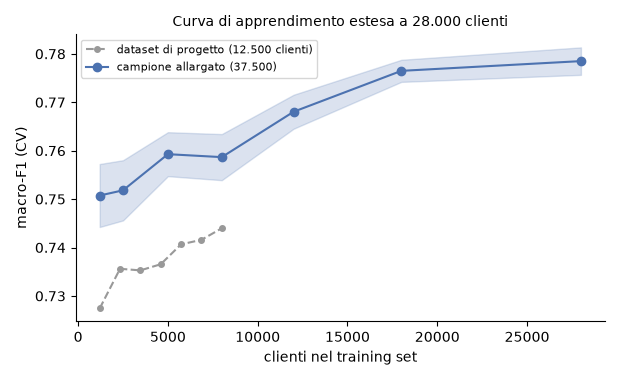

*Figura 19 — Curva di apprendimento estesa. La zona piatta fra 5.000 e 8.000 —
quella che aveva motivato la conclusione errata — è seguita da una ripresa netta.*

**Da 8.000 a 28.000 clienti: +1,98 punti di macro-F1.** Il gap train − CV scende
da 0,208 (a 1.200) a **0,036** (a 28.000): con più dati l'overfitting quasi
sparisce, comportamento atteso che conferma come il modello avesse ancora
capacità inutilizzata.

**Verifica end-to-end**, stessi iperparametri, valutazione sullo **stesso** test
set originale (2.500 clienti, escluso da entrambi i pool):

| Modello | Training | macro-F1 test | accuracy test |
|---|---|---:|---:|
| Random Forest | pool 10.000 | 0,7617 | 0,7688 |
| Random Forest | **pool 35.000** | **0,7805** | **0,7876** |
| Decision Tree (d=4) | pool 10.000 | 0,7459 | 0,7508 |
| Decision Tree (d=4) | pool 35.000 | 0,7456 | 0,7500 |

> **Più dati aiutano il modello ad alta capacità (+1,88 punti) e non fanno nulla
> per quello a bassa capacità (−0,03).**

Il risultato è coerente con la teoria: un albero di profondità 4 ha **14 foglie**
— la sua capacità satura immediatamente, e nessuna quantità di dati può fargli
rappresentare una funzione più ricca. Il Random Forest, con ~118.000 foglie,
aveva ancora spazio.

**Conseguenza sul trade-off centrale del progetto:** con 3,5× i dati il costo
della trasparenza **sale da 1,58 a 3,49 punti** (0,7805 vs 0,7456). La
convenienza dell'albero singolo non è una proprietà assoluta: dipende dalla
quantità di dati disponibili, e si riduce al crescere di questa.

> **Nota sul confronto.** Il pool allargato ha una distribuzione di classi
> leggermente diversa (Poor 30,0% vs 33,3%). Le due evidenze sono però
> indipendenti e concordi: la curva interna a `newtrain` (+1,98 punti da 8.000 a
> 28.000) isola l'effetto della quantità a distribuzione fissa, e il confronto
> end-to-end (+1,88) lo conferma su un held-out immutato.

## 8.3-ter Protocollo a tre blocchi 60/20/20

Con 12.500 clienti frammentare in tre blocchi fissi sarebbe stato uno spreco —
la CV usa i dati meglio di un blocco di validazione fisso, ed è la ragione per
cui il piano originale l'aveva escluso. Con 37.500 diventa permissibile, e serve
a rispondere a tre domande che il protocollo a due blocchi lasciava aperte.
Codice: `src/step11_scaling.py` (parte B).

| Blocco | n | Compito |
|---|---:|---|
| train | 22.500 | tuning delle 121 configurazioni, via CV interna |
| validation | 7.500 | **selezione** fra i modelli tunati — mai vista nel tuning |
| test | 7.500 | **stima finale** — mai visto, toccato una volta |

Distribuzione delle classi identica nei tre blocchi (30,25 / 53,23 / 16,52%).
Tutto rifittato da zero: nessun modello addestrato altrove entra, altrimenti i
blocchi non sarebbero davvero mai-visti.

### Le tre stime a confronto

| Modello | CV (train) | SE | validation | test | scarto val−CV |
|---|---:|---:|---:|---:|---:|
| **Random Forest** | **0,8388** | 0,0024 | **0,8461** | **0,8503** | +0,0073 |
| Gradient Boosting | 0,8229 | 0,0013 | 0,8392 | 0,8425 | +0,0163 |
| SVC (kernel RBF) | 0,8186 | 0,0022 | 0,8312 | 0,8335 | +0,0126 |
| Decision Tree | 0,7653 | 0,0029 | 0,7639 | 0,7667 | −0,0014 |
| Logistic Regression (L2) | 0,7260 | 0,0031 | 0,7265 | 0,7268 | +0,0005 |
| Linear SVC | 0,7196 | 0,0029 | 0,7168 | 0,7183 | −0,0028 |

Scarto medio |validation − CV| = **0,0068**; massimo 0,0163.

Lo scarto è **sistematicamente positivo per i modelli ad alta capacità**
(RF +0,007, GB +0,016, SVC +0,013) e nullo per quelli a bassa capacità
(albero −0,001, lineari ±0,003). La spiegazione è la stessa di §8.3-bis: in CV
il modello vede 4/5 dei dati (18.000), nel rifit finale li vede tutti (22.500).
Il 25% in più giova a chi ha capacità per usarlo, e non fa nulla agli altri.

### Tenuta su blocchi non osservati

| | macro-F1 | accuracy |
|---|---:|---:|
| CV interna (train) | 0,8388 | — |
| **validation (mai vista)** | **0,8461** | 0,8548 |
| **test (mai visto)** | **0,8503** | 0,8596 |
| test con **label permutato** (rumore puro) | 0,3282 | 0,3752 |

> Le tre stime differiscono di al più **0,0116** e distano **0,51 punti** dal
> rumore puro. Il modello selezionato non subisce alcuna degradazione su blocchi
> mai osservati: la stima interna era già affidabile, e il protocollo a due
> blocchi adottato nel corpo del lavoro non risulta ottimistico.

### Distorsione da selezione

| Criterio di selezione | Modello scelto |
|---|---|
| Regola 1-SE sulla CV | Random Forest |
| Migliore sul blocco di validazione | Random Forest |

> I due criteri concordano. Il gonfiamento da selezione stimato in via teorica
> in §4.2 (≈1,1 punti con 121 configurazioni) non si osserva: il modello vincente
> distanzia il secondo di 1,6 punti, margine troppo ampio perché la variabilità
> campionaria possa ribaltarlo.

### Ottimismo della stima interna

**Ottimismo CV vs test sul vincitore: −1,16 punti** — cioè la CV era
**conservativa**, non ottimista. Coerente col protocollo a due blocchi (−1,77
punti, §5), e per la stessa ragione: il rifit finale usa più dati di quanti ne
veda ogni fold.

### Dipendenza degli iperparametri dalla scala del campione

Il confronto fra le configurazioni ottimali alle due scale evidenzia uno
spostamento sistematico:

| | tunato su 10.000 | tunato su 22.500 |
|---|---|---|
| Random Forest | `max_depth=12, n_estimators=300` | **`max_depth=None, n_estimators=600`** |
| Decision Tree | `max_depth=6, min_samples_leaf=100` | **`max_depth=12, min_samples_leaf=1`** |

Con più dati gli alberi profondi smettono di overfittare e cominciano a rendere:
è il comportamento che la teoria prevede, osservato direttamente.

**Conseguenza quantitativa**, a parità di dimensione del training (18.000
clienti) e sullo stesso dataset:

| | macro-F1 CV |
|---|---:|
| Iperparametri riusati da 10.000 clienti (§8.3-bis) | 0,7765 |
| **Iperparametri ri-tunati su 22.500** | **0,8388** |

> **Il solo ri-tuning vale +6,2 punti.** In §8.3-bis gli iperparametri originali
> erano stati mantenuti fissi per isolare l'effetto della sola *quantità* di
> dati, ottenendo +1,88 punti. Come esperimento controllato la scelta è corretta,
> ma sottostima il guadagno complessivo: gli iperparametri ottimali per 10.000
> clienti non lo sono per 35.000. Un aumento della numerosità va accompagnato da
> una nuova ricerca degli iperparametri, pena la rinuncia a gran parte del
> beneficio.

Il divario lineare / non lineare esplode di conseguenza: da 3,2 punti (§4.1) a
**11,3** (0,8388 contro 0,7260). Su questa scala il problema esce dalla zona
grigia e la non linearità diventa decisamente necessaria — la conclusione di
§4.1 era corretta *per la scala a cui è stata presa*, e va citata con quella.

## 8.4 Effetto della pulizia di dominio

Ipotesi: se la corruzione fosse stata iniettata in modo correlato al target,
nullificarla costerebbe performance.

| Configurazione | Accuracy | macro-F1 |
|---|---:|---:|
| Con vincoli di plausibilità | 0,7476 | 0,7414 |
| Senza vincoli di plausibilità | 0,7487 | 0,7424 |

**Differenza: +0,11 punti**, entro un quarto di errore standard. La corruzione è
indipendente dal target, coerentemente con la missingness MCAR di §2.4. La
pulizia si giustifica sulla **correttezza** — non stiamo modellando su età
negative — non sulla performance.

## 8.5 Il vincolo dominante: rumore del label

- Solo il **41,7%** dei clienti ha lo stesso giudizio su tutti e 8 i mesi.
- Accordo medio con la moda: **84,4%**.
- Il 5,2% ha una parità perfetta fra due classi.

Il processo di scoring originale, **sullo stesso cliente e con feature quasi
identiche fra un mese e l'altro**, cambia idea nel **15,6% dei mesi**. La
relazione feature → label è in parte stocastica: nessun modello, di nessuna
complessità, può superare quel tetto.

Tre conferme indipendenti convergono:
1. accordo del label 86,3% (predizioni corrette) vs 78,6% (errate) — §5;
2. i casi SHAP A e B, spiegazioni identiche e label diversi — §6.2;
3. la curva di apprendimento piatta — §8.3.

## 8.6 Confronto con i riferimenti di settore

Il termine di paragone non è omogeneo:

1. **Il credit scoring in produzione è binario** (default / non default) con
   tassi di default dell'1–5%. Un modello che predice sempre "non default"
   ottiene 95%+ di accuratezza ed è inutile. Per questo il settore non usa
   l'accuratezza ma **AUC / Gini**, dove "buono" significa 0,75–0,85 — lontano
   dalla perfezione.
2. **Qui il problema è a tre classi** con distribuzione 49/33/18. La baseline
   banale è 48,9%, non 95%. Il modello fa **+28 punti** su di essa.
3. **Il target non è un default osservato** ma un giudizio pre-esistente e
   internamente incoerente al 15,6%.

## 8.7 Direzioni di miglioramento

1. **Più dati** — verificato: +1,88 punti passando da 10.000 a 35.000 clienti,
   ma **solo per il modello ad alta capacità** (§8.3-bis). Per l'albero di
   profondità 4 il guadagno è nullo: satura a 14 foglie.
2. **Un label meno rumoroso** — resta un vincolo strutturale (§8.5), ma il tetto
   che impone è più alto di quanto stimato inizialmente.
3. **Feature non presenti** (importo richiesto, garanzie, esposizioni su altri
   istituti).
4. **Non** meno pulizia (§8.4), **non** un modello più complesso: il gradient
   boosting tunato resta sotto il Random Forest.

---

# 9. Discussione, model card, limiti

## 9.1 Uso previsto

Progetto didattico. **Non utilizzabile per decisioni creditizie reali.**

## 9.2 Dati

12.500 clienti sintetici, 8 mesi ciascuno, fonte Kaggle. Nessuna PII reale:
`Name` e `SSN` sono sintetici e rimossi come primo passo insieme a `ID`.
Il target è un giudizio pre-esistente, non un default osservato.

## 9.3 Limiti dei dati

1. **Rumore del label** (§2.4, §8.5) — solo il 41,7% dei clienti ha un giudizio
   costante; il 5,2% ha una parità risolta con una regola prudenziale.
2. **Incoerenze inter-colonna** — 965 clienti (7,7%) hanno `Annual_Income`
   variabile fra mesi, quando dovrebbe essere costante. Assorbito dalla mediana,
   ma resta un indice di qualità del dataset.
3. **Corruzione iniettata** — sentinelle testuali e valori assurdi su 1–4,4%
   delle righe per colonna.
4. **Semantica di dominio non rispettata** — il *tipo* di prestito non
   discrimina (§2.6), mentre nel credit risk reale un Payday Loan è un segnale
   molto più forte di un Auto Loan.
5. **688 clienti (5,5%) hanno 14–17 anni**, sotto l'età legale per contrarre
   credito nella quasi totalità degli ordinamenti.

## 9.4 Limiti del modello

- Feature ad alto peso (`Credit_Mix`, `Interest_Rate`) sono plausibilmente
  output del processo di scoring che si sta replicando: **componente di
  circolarità non eliminabile** con questi dati.
- Performance stimata su un unico split 80/20 con seed fisso. Nessun intervallo
  di confidenza sul macro-F1 di test (la variabilità in CV era ±0,004–0,012).
- **Nessuna calibrazione delle probabilità**: `predict_proba` non va letto come
  probabilità di rischio ben calibrata.
- **Nessuna validazione temporale**: il panel di 8 mesi è stato collassato,
  quindi non c'è garanzia di tenuta su dati futuri (drift non testabile).
- **Il trade-off centrale dipende dalla scala dei dati**: 1,58 punti a 10.000
  clienti, 3,49 a 35.000 (§8.3-bis). Va citato con la numerosità a cui si
  riferisce, non come costante.
- **Bias di selezione residuo** (§4.2): 121 configurazioni valutate sugli stessi
  fold. Mitigato ma non eliminato dal test set held-out.

## 9.5 Limiti del fairness check

- **Un solo attributo protetto** (età), l'unico disponibile. Genere, etnia,
  residenza — centrali nel credito reale — non sono nel dataset.
- **Fascia 60+ vuota** (età massima 56): l'analisi copre 3 gruppi, e proprio la
  fascia anziana, storicamente esposta a discriminazione creditizia, manca.
- Sottogruppi da 2.790 a 4.403 clienti in OOF: sufficienti per i gap riportati,
  al limite per analisi più fini (es. età × tipo di prestito).
- Le metriche misurano la **conservazione e amplificazione del bias del processo
  originale**, non l'equità in senso assoluto: il ground truth è esso stesso il
  prodotto di un giudizio potenzialmente distorto.
- **Nessuna mitigazione implementata**; l'unica testata (rimozione
  dell'attributo) è risultata inefficace.

## 9.6 Sintesi del trade-off

| | Filone A | Filone B |
|---|---|---|
| Modello | Random Forest (300 alberi, prof. 12) | Albero singolo, prof. 4 |
| Foglie | 117.956 | **14** |
| macro-F1 test | 0,7617 | 0,7459 |
| Interpretabilità | post-hoc (SHAP) | **nativa, una pagina** |
| Adverse action notice | derivabile da SHAP, con costo di calcolo e di spiegazione | leggibile dal percorso |

**Costo della trasparenza: 1,58 punti di macro-F1 (−2,1% relativo).**

## 9.7 Conclusioni

Il lavoro risponde alle sette domande di §1.5:

- **Q1** Il problema **non** è lineare-sufficiente: gap di 3,2 punti fra Random
  Forest e regressione logistica, ben oltre il rumore. Ma la struttura utile è
  **poco profonda**: un albero di profondità 4 recupera i due terzi del divario.
- **Q2** Filone A = Random Forest, per applicazione della regola 1-SE dichiarata
  a priori.
- **Q3** Restando pienamente interpretabili si arriva a 0,7459 sul test — con un
  modello di 14 foglie.
- **Q4** **1,58 punti di macro-F1.**
- **Q5** Il modello si regge sulle famiglie canoniche del credit scoring; due
  delle feature principali sono però output del processo replicato.
- **Q6** Il modello **amplifica** la disparità d'età, con FPR su `Poor` 2,7
  volte più alto per gli under-25; rimuovere l'età non serve.
- **Q7** Concorrono due limiti: il **rumore del label** (strutturale) e la
  **numerosità** (aggredibile). Con 3,5× i dati il Random Forest sale a 0,7805,
  l'albero di profondità 4 resta a 0,7456: il costo della trasparenza sale da
  1,58 a 3,49 punti. Non è la pulizia (§8.4) né la capacità del modello.

Il contributo metodologico che riteniamo più trasferibile è **§8.1**:
l'aggregazione per cliente, adottata per ragioni di rigore (impedire il
leakage), si è rivelata anche la scelta più performante, perché la mediana su 8
osservazioni è un filtro di rumore. Rigore e performance, in questo caso,
puntano nella stessa direzione — il che non è scontato e vale la pena verificarlo
invece di assumerlo in un senso o nell'altro.

---

# 10. Appendici

## A. Struttura del codice

**Moduli condivisi** — nessuna logica di analisi, solo definizioni riusate:

| File | Responsabilità |
|---|---|
| `config.py` | Path, seed (42), metrica primaria, bin d'età, flag delle estensioni |
| `data_prep.py` | Cleaning riga per riga + aggregazione per cliente |
| `features.py` | Spazio delle feature, preprocessing |
| `models.py` | Catalogo dei candidati: costruttori, griglie, ordine di complessità |
| `evaluation.py` | Caricamento split, tuning in CV, regola 1-SE |

**Step della pipeline** — uno per domanda:

| Step | Domanda | Sezione |
|---|---|---|
| `step01_build_dataset` | Da 100.000 righe sporche a 12.500 clienti puliti | §2 |
| `step02_eda` | Cosa dicono i dati prima di modellare | §2.7 |
| `step03_baselines` | Quanto vale la non linearità | §4.1 |
| `step04_filone_a` | Il modello più semplice che basta | §4.2 |
| `step05_filone_b` | Quanto lontano si arriva restando interpretabili | §4.3 |
| `step06_final_test` | Quanto vale sul test toccato una sola volta | §5 |
| `step07_shap` | Su cosa si basa il modello | §6 |
| `step08_fairness` | Tratta le fasce d'età allo stesso modo | §7 |
| `step09_diagnostics` | Perché ci si ferma al 76,9% | §8 |
| `step10_summary` | Cosa va nel paper | — |
| `step11_scaling` | *(appendice)* Più dati aiutano? Il protocollo regge su blocchi mai visti? | §8.3-bis/ter |

## B. Griglie di iperparametri

| Modello | Griglia | Config |
|---|---|---:|
| Logistic L2 | `C ∈ {0.01, 0.03, 0.1, 0.3, 1, 3, 10}` | 7 |
| Logistic L1 | `C ∈ {0.002, 0.005, 0.01, 0.03, 0.1, 0.3, 1}` | 7 |
| Linear SVC | `C ∈ {0.003, 0.01, 0.03, 0.1, 0.3, 1}` | 6 |
| Decision Tree (A) | `max_depth ∈ {3,4,5,6,8,12,None}` × `min_samples_leaf ∈ {1,10,50,100}` | 28 |
| Decision Tree (B) | `max_depth ∈ {3,4}` × `min_samples_leaf ∈ {10,50,100,200}` × `criterion ∈ {gini, entropy}` | 16 |
| Random Forest | `n_estimators ∈ {300,600}` × `max_depth ∈ {None,12,20}` × `min_samples_leaf ∈ {1,3,10}` × `max_features ∈ {sqrt, 0.4}` | 36 |
| Gradient Boosting | `lr ∈ {0.05,0.1}` × `max_leaf_nodes ∈ {15,31,63}` × `max_iter ∈ {200,400}` × `l2 ∈ {0,1}` | 24 |
| SVC RBF | `C ∈ {0.3,1,3,10,30}` × `gamma ∈ {scale, 0.003, 0.01, 0.03}` | 20 |

## C. Uso del test set

Tracciato esplicitamente, perché è la garanzia principale del protocollo:

| Step | Uso | Decisione presa? |
|---|---|---|
| `step06` | Metrica finale di entrambi i filoni | **No** — modelli già bloccati |
| `step07` | Spiegazioni SHAP post-hoc | No |
| `step08` | Seconda vista sulla fairness (dichiarata) | No |
| `step09` | Ri-riporta il numero già pubblicato da step06 | No |

Tutte le ablation (`class_weight`, pulizia) vivono in CV sul train pool: sono
confronti fra configurazioni, cioè il tipo di scelta che il test set non deve
arbitrare.

## D. Riproducibilità

`RANDOM_STATE = 42` ovunque. Dipendenze fissate in `requirements.txt`
(numpy 2.4.6, pandas 3.0.5, scikit-learn 1.9.0, statsmodels 0.14.6, shap 0.52.0).
Pipeline completa: `python src/run_all.py` (~20 minuti). L'unica sorgente di
variabilità residua è il parallelismo di `n_jobs=-1`, che non influenza i
risultati riportati.

## E. Indice delle figure

| # | File | Sezione |
|---|---|---|
| 1 | `01_target_distribution.png` | §2.1 |
| 2 | `05_age_and_target.png` | §2.4 |
| 3 | `06_loan_types.png` | §2.6 |
| 4 | `03_mutual_information.png` | §2.7 |
| 5 | `04_top_features_by_class.png` | §2.7 |
| 6 | `02_correlation.png` | §2.7 |
| 7 | `07b_l1_path.png` | §4.3 |
| 8 | `07_l1_coefficients.png` | §4.3 |
| 9 | `08_decision_tree.png` | §4.3 |
| 10 | `09_confusion_test.png` | §5 |
| 11 | `10_shap_global_bar.png` | §6.1 |
| 12 | `11_shap_beeswarm_poor.png` | §6.1 |
| 13 | `12_shap_dependence_1_Credit_Mix_Good.png` | §6.1 |
| 14–16 | `13_shap_local_{A,B,C}*.png` | §6.2 |
| 17 | `14_fairness_parity.png` | §7.1 |
| 18 | `15_learning_curve.png` | §8.3 |
| 19 | `16_learning_curve_estesa.png` | §8.3-bis |

## F. Tabelle di risultato (CSV)

Tutti i numeri di questo documento sono rigenerabili:
`step0_baselines.csv`, `filone_a_tuning.csv`, `filone_a_se_sensitivity.csv`,
`filone_b_l1_sparsity.csv`, `filone_b_l1_coefficients.csv`, `filone_b_vif.csv`,
`filone_b_statsmodels.txt`, `final_test_results.csv`,
`shap_global_importance.csv`, `fairness_oof.csv`, `fairness_test.csv`,
`fairness_unawareness.csv`, `diagnostica_t1..t4*.csv`; per l'appendice §8.3-bis/ter `scaling_*.csv` e
`holdout_*.csv`.
